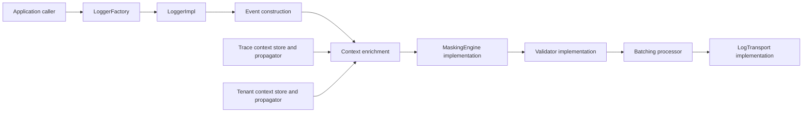

[CodeWiki](../../index.md) / [Artifacts](../index.md) / Java SDK Implementation Plan

# Java SDK Implementation Plan

## Outcome and boundaries

This plan turns `packages/java` from API contracts into a Java 17 implementation of the DT3 structured logging SDK. The implementation will create canonical `LogEvent` records, enrich them from local trace and tenant context, mask sensitive values before export, apply the configured validation behavior, batch when enabled, and deliver JSON through selectable transports.

The work is limited to the Java package, its Maven dependencies, Java tests, and package documentation. It does not alter the language-neutral specifications or schemas, does not implement the currently skeletal Spring integration, and does not change the Node or Python SDKs. Required field names, schema semantics, default configuration values, and fail-open-by-default behavior remain invariant.

## Current architecture

`packages/java` is a Java 17 Maven JAR named `dt3-commons-api`. It currently contains public contracts under `com.digitalt3.commons.api`, including `Logger`, `LogTransport`, `MaskingEngine`, `Validator`, `Timer`, `SdkConfig`, `TraceContext`, `TenantContext`, `ValidationMode`, and the mutable `LogEvent` model. The only test, `ContractCompilationTest`, validates construction and enum availability rather than runtime behavior.

The governing `specs/logging.yaml` requires an ordered pipeline of event factory, enrichment, masking, validation, batching, and exporter stages. `LogEvent.toMap()` already supplies the schema’s dot-separated field names, but `Logger` omits the specified `event(LogEvent)` and `startTimer(String, Map<String, Object>)` operations despite `Timer` Javadoc referencing `startTimer`. `SdkConfig` carries only a subset of the normalized configuration surface; it lacks exporter endpoints and batching settings. `LogTransport` supports write, flush, and shutdown, allowing concrete transports to remain independent of logger processing.

The Java package does not currently implement trace or tenant propagation. The specifications define W3C `traceparent`, custom `x-correlation-id`, and tenant headers `x-tenant-id`, `x-tenant-region`, and `x-tenant-environment`. The protocol requires JSON for stdout and file output, JSON over HTTP, and OTLP-compatible transport. Existing Node and Python code demonstrates only a basic event-to-stdout flow and recursive masking; it is supporting parity evidence, not a substitute for implementing the stable Java requirements.

## Proposed change overview

The selected design adds implementation classes beneath `com.digitalt3.commons.sdk` while retaining stable contracts in `com.digitalt3.commons.api`. A `LoggerFactory` will normalize and validate `SdkConfig`, build a processing graph, and return `LoggerImpl`. `LoggerImpl` will create and emit events synchronously into the pipeline. The pipeline will enrich the event, run recursive masking, apply the selected validation mode, enqueue or immediately dispatch the resulting event, and use one `LogTransport` implementation chosen by configuration.

Use Jackson for serializing `LogEvent.toMap()` and schema parsing, a Draft 2020-12-capable Java JSON Schema validator for runtime schema conformance, and Java 17 `java.net.http.HttpClient` for HTTP and OTLP-compatible transport. Use JUnit Jupiter and Maven Surefire for tests. Because the repository already targets Java 17 and the contracts expose synchronous `void` logger methods, batching will use a bounded, thread-safe queue and a daemon scheduled executor; `flush()` synchronously drains the queue and delegates to the transport. `shutdown()` remains a transport lifecycle operation until a future public logger lifecycle contract adds close semantics.

## Execution steps

### STEP-01: Establish Java build dependencies and complete the public contract

**Owner:** CodeWritingAgent  
**Container:** all  
**Status:** ⏳ `to_do`  
**Depends on:** None

**Objective:** Make the Maven module capable of compiling and testing a production Java SDK, then correct the API omissions that prevent the documented logging pipeline from being expressed.

**Definition of done:** The Java module compiles with concrete JSON, schema-validation, and JUnit test dependencies, while public contracts expose the configuration and logger operations required by the stable specifications.

**Technical approach:** Add explicit dependency versions and Maven plugin configuration to `packages/java/pom.xml`: Jackson Databind for JSON serialization and JSON tree conversion; a JSON Schema Draft 2020-12 implementation compatible with Jackson; JUnit Jupiter and Maven Surefire. Rename the artifact from `dt3-commons-api` to the implementation-oriented `dt3-commons` while retaining the current group ID and package names.

Extend `Logger` with `event(LogEvent)` and `startTimer(String, Map<String, Object>)`, matching `specs/logging.yaml` and resolving the broken `Timer` Javadoc reference. Preserve existing methods rather than replacing their signatures. Add a default overload pattern only when it avoids caller ambiguity; the existing two-argument context methods remain source-compatible. Add a concrete `ValidationException` for STRICT behavior.

Expand `SdkConfig` with the configuration fields named in `specs/config.yaml` and `schemas/sdk-config.schema.json`: exporter file path, HTTP endpoint and timeout, masking field list, replacement value, masked-field tracking, batching enabled flag, maximum batch size, and flush interval. Provide a `validateAndNormalize()` method or a dedicated `SdkConfigResolver` that rejects missing required service metadata at construction time and applies documented defaults. The selected approach is a dedicated resolver so `SdkConfig` stays a mutable API model but runtime collaborators receive an immutable resolved configuration.

| File/component and symbol | Concrete change or resulting code shape | Integration/compatibility impact | Acceptance/validation |
| --- | --- | --- | --- |
| `packages/java/pom.xml` | Add Jackson, a Draft 2020-12 JSON Schema validator, JUnit Jupiter, and Maven Surefire; change artifact ID to `dt3-commons`. | Existing Maven compile target stays Java 17; Maven test becomes the Java quality gate. | AC-01, AC-04, AC-05; VAL-01, VAL-03 |
| `packages/java/src/main/java/com/digitalt3/commons/api/Logger.java` | Add `void event(LogEvent event)` and `Timer startTimer(String eventName, Map<String, Object> context)`. | Adds source-compatible API methods required by `specs/logging.yaml`; repairs the Timer Javadoc target. | AC-01, AC-07; VAL-01 |
| `packages/java/src/main/java/com/digitalt3/commons/api/SdkConfig.java` | Add normalized config properties and accessors for exporter, masking, and batching fields. | Enables all documented configuration keys without schema changes. | AC-01, AC-05; VAL-01, VAL-03 |
| `packages/java/src/main/java/com/digitalt3/commons/api/ValidationException.java` | Create a runtime exception carrying immutable validation errors. | Used only by STRICT validation; LENIENT and OFF retain non-throwing behavior. | AC-04; VAL-03 |
| `packages/java/src/main/java/com/digitalt3/commons/sdk/config/SdkConfigResolver.java` | Create immutable resolved configuration and required-field validation. | Keeps mutable `SdkConfig` compatible while centralizing defaults and conversion. | AC-01, AC-05; VAL-01, VAL-03 |

**Acceptance:** AC-01 — concrete public entry points and normalized configuration exist; AC-04 — STRICT has a dedicated error type; AC-05 — exporter and batching configuration can be resolved.

**Validation:** VAL-01 — compilation and factory contract tests; VAL-03 — validation-mode configuration tests.

**Recovery:** Revert only the Java POM and contract additions if dependency resolution or signature compilation fails. Do not modify shared schemas or specifications to accommodate an implementation defect.

#### Implementation Tracker

- [ ] Update `packages/java/pom.xml` with Java 17-compatible runtime and JUnit test dependencies plus Surefire configuration.
- [ ] Extend `Logger` with the specification-required `event` and `startTimer` operations.
- [ ] Add `ValidationException` under `com.digitalt3.commons.api`.
- [ ] Extend `SdkConfig` for exporter, masking, and batching values from `specs/config.yaml`.
- [ ] Implement immutable normalized configuration in `SdkConfigResolver`.
- [ ] Update `ContractCompilationTest` to compile the expanded public API.

### STEP-02: Implement event construction, recursive masking, validation, and context propagation

**Owner:** CodeWritingAgent  
**Container:** all  
**Status:** ⏳ `to_do`  
**Depends on:** STEP-01

**Objective:** Build the deterministic, schema-aligned processing components that produce and safely enrich a `LogEvent` before any transport is invoked.

**Definition of done:** A generated or supplied event is populated with canonical fields and context, recursively masked without changing caller data, validated according to its configured mode, and ready for batching or direct transport.

**Technical approach:** Create package-private or public SDK implementation classes beneath `com.digitalt3.commons.sdk`. `EventFactory` will use `Instant.now().toString()` for schema-compatible UTC timestamps, enforce the `GENERIC_EVENT` fallback when logger method calls omit `event.name`, merge a defensive copy of context, and map all recognized dot-separated fields into `LogEvent`. Unknown context keys will be placed into `attributes` rather than added as arbitrary top-level fields, preserving canonical output while supporting the schema’s extensibility. Explicitly supplied recognized context fields override only defaults; logger-owned timestamp, severity, message, SDK metadata, and structured `Throwable` fields win over conflicting context values.

Use `Throwable` stack printing through `StringWriter` and `PrintWriter` to populate `error.type`, `error.message`, and `error.stack`. Do not infer `error.code` or `error.retryable` without explicit context.

Implement `RecursiveMaskingEngine` against an expanded `MaskingEngine` result contract. The existing `Map<String, Object> mask` return cannot return tracked paths, so add `MaskingResult` and `maskWithResult(Map<String, Object>)` while retaining `mask` as a compatibility convenience. Traverse `Map<?, ?>`, `Iterable<?>`, and Java arrays; create ordered `LinkedHashMap` and new list/array-compatible copies; compare `String.valueOf(key)` with `Locale.ROOT` case folding; and avoid mutating any input collection. Set `dt3.security.masked_fields` only when tracking is enabled and paths exist.

Implement `JsonSchemaValidator` by converting `LogEvent.toMap()` to a Jackson `JsonNode` and validating it against a classpath copy of `schemas/log-event.schema.json`. Copy the schema to `packages/java/src/main/resources/schemas/log-event.schema.json` so the packaged JAR performs validation without repository-relative file access. Return schema errors as stable field-oriented strings. In STRICT, throw `ValidationException` before the event reaches batching or a transport. In LENIENT, add `dt3.validation.errors` to the event and continue. In OFF, bypass validator invocation entirely.

Use a `ContextStore` backed by `ThreadLocal<TraceContext>` and `ThreadLocal<TenantContext>` with scoped `set`, `get`, and `clear` operations. Implement `ContextPropagator` to safely inject or extract `traceparent`, `x-correlation-id`, and tenant headers. Parse only valid lowercase hexadecimal W3C IDs; return empty context for missing or malformed values. `ContextEnricher` copies present values into an event only when the event does not already contain the equivalent explicit field.

| File/component and symbol | Concrete change or resulting code shape | Integration/compatibility impact | Acceptance/validation |
| --- | --- | --- | --- |
| `packages/java/src/main/java/com/digitalt3/commons/sdk/EventFactory.java` | Create canonical events from logger calls and supplied `LogEvent` instances using defensive context copies and canonical metadata precedence. | Uses existing `LogEvent` fields and `toMap()` without changing schema field names. | AC-02; VAL-01 |
| `packages/java/src/main/java/com/digitalt3/commons/sdk/RecursiveMaskingEngine.java` | Implement case-insensitive recursive masking for maps, iterables, and arrays, including optional path tracking. | Implements `MaskingEngine`; caller collections are never mutated. | AC-03; VAL-02 |
| `packages/java/src/main/java/com/digitalt3/commons/api/MaskingResult.java` and `MaskingEngine.java` | Add immutable masking result and `maskWithResult`; retain `mask` as a compatibility method returning only copied data. | Adds tracking capability without breaking callers using `mask`. | AC-03; VAL-02 |
| `packages/java/src/main/java/com/digitalt3/commons/sdk/JsonSchemaValidator.java` | Validate Jackson event JSON against classpath `log-event.schema.json` and return `Validator.ValidationResult`. | Implements existing `Validator` interface and stable validation modes. | AC-04; VAL-03 |
| `packages/java/src/main/resources/schemas/log-event.schema.json` | Package the canonical schema used by runtime validation. | Must remain byte-for-byte semantically aligned with repository schema during implementation. | AC-04; VAL-03 |
| `packages/java/src/main/java/com/digitalt3/commons/sdk/context/ContextStore.java`, `ContextPropagator.java`, and `ContextEnricher.java` | Add ThreadLocal context ownership, W3C and DT3 header injection/extraction, and event enrichment. | Adds Java runtime context support without modifying `TraceContext` or `TenantContext` fields. | AC-02, AC-06; VAL-01, VAL-05 |

**Acceptance:** AC-02 — canonical event and structured error handling; AC-03 — non-mutating recursive masking; AC-04 — validation semantics; AC-06 — safe propagation and enrichment.

**Validation:** VAL-01 — event-building tests; VAL-02 — masking tests; VAL-03 — validation tests; VAL-05 — propagation tests.

**Recovery:** Keep processors independently testable behind their API boundaries. If a component breaks contract validation, restore its last passing implementation rather than changing field names or weakening shared schemas.

#### Implementation Tracker

- [ ] Create `EventFactory` with canonical metadata, context precedence, defensive copying, and Throwable stack capture.
- [ ] Add `MaskingResult` and implement `RecursiveMaskingEngine` for maps, lists, arrays, custom fields, and path tracking.
- [ ] Package `log-event.schema.json` as a Java resource and implement `JsonSchemaValidator`.
- [ ] Apply STRICT, LENIENT, and OFF behavior at the processing boundary.
- [ ] Implement ThreadLocal context storage plus W3C trace and DT3 tenant propagation.
- [ ] Add `ContextEnricher` so explicit event fields take precedence over stored context.

### STEP-03: Implement transports, batching, concrete logger, and timer behavior

**Owner:** CodeWritingAgent  
**Container:** all  
**Status:** ⏳ `to_do`  
**Depends on:** STEP-02

**Objective:** Connect processing components into the concrete logger and provide the documented delivery, flushing, batching, and timing behavior.

**Definition of done:** A factory-created logger sends processed JSON events to the selected transport, correctly handles queueing and flush, keeps logging failures non-fatal when fail-open is enabled, and produces one completion event from a single-use timer.

**Technical approach:** Implement `LoggerFactory.createLogger(SdkConfig)` as the Java public construction entry point. It will resolve config, construct masking, validation, context enrichment, batching, and selected `LogTransport`, then return `LoggerImpl`. `LoggerImpl` will implement all `Logger` operations. `debug`, `info`, `warn`, and `error` delegate to a shared emission method. `event` accepts a caller-created event, fills missing required metadata only, then sends it through the same processor path. `flush` drains any batching queue before calling `LogTransport.flush`.

Implement `StdoutLogTransport` using Jackson serialization to a supplied `PrintStream`, allowing test capture without global `System.out` replacement. Implement `FileLogTransport` with UTF-8 line-delimited JSON, a configured `Path`, synchronized writes, and flush/close behavior. Implement `HttpLogTransport` using `HttpClient`, POST, `application/json`, configured timeout, and a single event object as the request body. Implement `OtlpHttpLogTransport` as an HTTP transport that posts the same canonical JSON to its configured endpoint; its name reflects protocol configuration, but it does not claim protobuf OTLP support because the repository protocol only specifies OTLP-compatible transport and JSON over HTTP. Require a nonblank endpoint for HTTP and OTLP configurations and a path for the file configuration at config-resolution time.

Implement `BatchingProcessor` with a bounded `LinkedBlockingQueue<LogEvent>`, `ScheduledExecutorService`, maximum-size drain, and interval drain. When batching is disabled, write immediately. Preserve original event order within a flush batch. Because `LogTransport` defines only `write(LogEvent)`, drain batches by calling `write` per event; do not add an unverified batch transport contract. A failed queue insertion or transport write is processed by `PipelineErrorHandler`: it writes a concise diagnostic to `System.err` and suppresses the error only when `fail_open` is true; otherwise it propagates an SDK runtime exception to the caller.

Implement `TimerImpl` with `System.nanoTime()` start time, an `AtomicBoolean` end guard, a copied initial context, and a reference to `Logger`. `end(true, context)` emits an INFO event; `end(false, context)` emits an ERROR event. Both merge initial and end context, set `duration.ms` in milliseconds as a non-negative double, and return the emitted event map. A second `end` throws `IllegalStateException`, preventing duplicate records.

| File/component and symbol | Concrete change or resulting code shape | Integration/compatibility impact | Acceptance/validation |
| --- | --- | --- | --- |
| `packages/java/src/main/java/com/digitalt3/commons/sdk/LoggerFactory.java` | Create `createLogger(SdkConfig)` to resolve config and wire the processing pipeline. | New Java entry point; preserves `Logger` abstraction. | AC-01, AC-05; VAL-01, VAL-04 |
| `packages/java/src/main/java/com/digitalt3/commons/sdk/LoggerImpl.java` | Implement all logger methods and the shared pipeline invocation with fail-open handling. | Implements existing interface plus new specified operations. | AC-01, AC-02, AC-05; VAL-01, VAL-04 |
| `packages/java/src/main/java/com/digitalt3/commons/sdk/transport/StdoutLogTransport.java` | Emit one UTF-8 JSON event line to a configurable `PrintStream`. | Default `stdout` behavior; testable without replacing global output. | AC-05; VAL-04 |
| `packages/java/src/main/java/com/digitalt3/commons/sdk/transport/FileLogTransport.java` | Append line-delimited JSON to the configured file and release resources on shutdown. | Supports the configured file exporter. | AC-05; VAL-04 |
| `packages/java/src/main/java/com/digitalt3/commons/sdk/transport/HttpLogTransport.java` and `OtlpHttpLogTransport.java` | POST canonical JSON using `HttpClient`; configure endpoint and timeout. | Satisfies protocol JSON-over-HTTP and OTLP-compatible JSON path without adding protobuf behavior. | AC-05; VAL-04 |
| `packages/java/src/main/java/com/digitalt3/commons/sdk/BatchingProcessor.java` and `PipelineErrorHandler.java` | Add queue scheduling, synchronous flush, ordered per-event dispatch, and fail-open diagnostics. | Uses unchanged `LogTransport.write`, `flush`, and `shutdown`. | AC-05; VAL-04 |
| `packages/java/src/main/java/com/digitalt3/commons/sdk/TimerImpl.java` | Provide monotonic, single-use duration emission for `Logger.startTimer`. | Implements existing `Timer.end` API and its existing Javadoc intent. | AC-07; VAL-05 |

**Acceptance:** AC-01 — concrete logger and factory; AC-02 — all records pass the established pipeline; AC-05 — transports, batching, and failure behavior; AC-07 — timer behavior.

**Validation:** VAL-01 — logger event tests; VAL-04 — transport/batching/fail-open tests; VAL-05 — timer tests.

**Recovery:** Configure synchronous stdout with batching disabled when diagnosing transport or scheduler defects. Preserve the default fail-open behavior unless a test intentionally supplies `fail_open=false`.

#### Implementation Tracker

- [ ] Add `LoggerFactory` and wire normalized configuration to all implementation collaborators.
- [ ] Implement `LoggerImpl` for level methods, `event`, `startTimer`, and `flush`.
- [ ] Implement stdout and file line-delimited JSON transports.
- [ ] Implement HTTP and OTLP-compatible JSON-over-HTTP transports using `HttpClient`.
- [ ] Implement queue-based batching, ordered draining, and pipeline error handling.
- [ ] Implement single-use monotonic `TimerImpl`.

### STEP-04: Add Java SDK runtime and integration tests

**Owner:** TestCodeWritingAgent  
**Container:** all  
**Status:** ⏳ `to_do`  
**Depends on:** STEP-03

**Objective:** Replace the current compilation-only safety net with runtime tests that prove the Java SDK conforms to the repository’s stable contracts.

**Definition of done:** The Java test suite isolates transports with in-memory or loopback fixtures and covers each acceptance criterion without external cloud services.

**Technical approach:** Migrate `ContractCompilationTest` to JUnit Jupiter and preserve its construction coverage. Create small, behavior-focused test classes under `packages/java/src/test/java/com/digitalt3/commons/sdk`. Provide an in-memory `LogTransport` test double that captures `LogEvent` instances for assertions. Use JDK `com.sun.net.httpserver.HttpServer` bound to loopback for HTTP and OTLP-compatible HTTP tests, eliminating external dependencies. Use temporary directories for file output and clean them with JUnit `@TempDir`.

Write tests around the canonical schema, rather than snapshots with arbitrary fields. Assert required fields, schema-valid timestamps, UPPER_SNAKE_CASE event naming, structured Throwable stack data, metadata precedence, context non-mutation, and enrichments. Use intentionally malformed events such as `event.name=not-valid` to prove each validation mode. Verify masking path notation for nested map and list values, disabled masking deep-copy behavior, and custom field matching. Verify propagation round trips for valid headers and safe empty contexts for malformed headers. Verify batching flushes at capacity and explicit `flush`, while disabled batching writes synchronously. Verify fail-open does not throw on a failing transport, and fail-closed does.

| File/component and symbol | Concrete change or resulting code shape | Integration/compatibility impact | Acceptance/validation |
| --- | --- | --- | --- |
| `packages/java/src/test/java/com/digitalt3/commons/ContractCompilationTest.java` | Convert imports/annotations to JUnit Jupiter and add coverage for factory and expanded `Logger` API compilation. | Keeps baseline contract coverage current. | AC-01, AC-08; VAL-01, VAL-06 |
| `packages/java/src/test/java/com/digitalt3/commons/sdk/LoggerPipelineTest.java` | Assert event creation, error enrichment, context precedence, canonical fields, and no caller-map mutation. | Verifies pipeline behavior through public logger calls. | AC-02; VAL-01 |
| `packages/java/src/test/java/com/digitalt3/commons/sdk/RecursiveMaskingEngineTest.java` | Assert nested maps/lists/arrays, custom fields, paths, disabled behavior, and immutable input. | Protects confidentiality and cross-language masking parity. | AC-03; VAL-02 |
| `packages/java/src/test/java/com/digitalt3/commons/sdk/JsonSchemaValidatorTest.java` | Assert STRICT exception, LENIENT annotations, and OFF bypass using invalid data. | Verifies stable validation mode contract. | AC-04; VAL-03 |
| `packages/java/src/test/java/com/digitalt3/commons/sdk/TransportAndBatchingTest.java` | Test stdout, temporary files, loopback HTTP, OTLP-compatible HTTP, batching thresholds, flush, and fail-open behavior. | Validates transports without network infrastructure. | AC-05; VAL-04 |
| `packages/java/src/test/java/com/digitalt3/commons/sdk/ContextPropagationTest.java` and `TimerImplTest.java` | Test headers, empty or malformed context behavior, enrichment, duration, success/failure severity, and single-use timers. | Verifies propagation and existing Timer contract. | AC-06, AC-07; VAL-05 |

**Acceptance:** AC-02 through AC-08 are covered by concrete Java runtime tests.

**Validation:** VAL-01 through VAL-06 are implemented as JUnit tests and Maven suite execution.

**Recovery:** Keep test-only loopback servers and temporary output inside JUnit lifecycle methods. Remove partial assertions that contradict stable schemas or specs rather than weakening implementation requirements.

#### Implementation Tracker

- [ ] Migrate and extend `ContractCompilationTest` for JUnit Jupiter and the Java logger factory.
- [ ] Add pipeline tests for canonical events, errors, enrichment, and caller-context immutability.
- [ ] Add masking and validation-mode test classes.
- [ ] Add transport, batching, flush, and fail-open tests using test doubles, `HttpServer`, and `@TempDir`.
- [ ] Add trace and tenant propagation tests.
- [ ] Add timer behavior tests, including duration and duplicate-end protection.

### STEP-05: Execute and verify the Java SDK test suite

**Owner:** TestExecutionAgent  
**Container:** all  
**Status:** ⏳ `to_do`  
**Depends on:** STEP-04

**Objective:** Produce final evidence that the implemented Java SDK compiles and meets the plan’s runtime acceptance criteria.

**Definition of done:** `mvn test` succeeds in `packages/java`, Surefire reports show all Java SDK runtime tests passed, and the test output demonstrates no unresolved dependency or test-discovery failures.

**Technical approach:** Run the Maven test lifecycle from `packages/java` using non-interactive CI-compatible arguments. If a test fails, identify the smallest failing class, return the failure to the implementation owner, and rerun the focused test after correction before rerunning the full suite. The final run must include all tests, not only focused reruns.

**Acceptance:** AC-08 — Maven test execution provides complete Java SDK verification evidence.

**Validation:** VAL-06 — `mvn test`.

**Recovery:** Preserve Surefire reports and rerun the smallest failing test class after a corrective change. Do not treat `mvn compile` as a substitute for the runtime suite.

#### Implementation Tracker

- [ ] Run `mvn test` from `packages/java`.
- [ ] Inspect Surefire reports for all runtime test classes and zero failures.
- [ ] Rerun any focused failure after correction, then rerun the full Maven suite.
- [ ] Record the final command result and test evidence in this plan’s execution record.

## Acceptance and verification matrix

| Acceptance ID | Observable result | Validation ID | Method or command | Expected evidence |
| --- | --- | --- | --- | --- |
| AC-01 | A factory-created concrete Java logger exposes and implements the public contract. | VAL-01 | `Set-Location packages/java; mvn test` | Factory and contract tests compile and execute against `LoggerImpl`. |
| AC-02 | Events have canonical required fields, structured errors, context enrichment, and immutable inputs. | VAL-01 | `Set-Location packages/java; mvn test -Dtest=LoggerPipelineTest` | Captured `LogEvent` maps contain required keys, stack data, and unchanged source context. |
| AC-03 | Masking copies and redacts nested data according to the specification. | VAL-02 | `Set-Location packages/java; mvn test -Dtest=RecursiveMaskingEngineTest` | Assertions show redaction, case-insensitive matching, tracked paths, and no mutation. |
| AC-04 | Validation behavior differs correctly among STRICT, LENIENT, and OFF. | VAL-03 | `Set-Location packages/java; mvn test -Dtest=JsonSchemaValidatorTest` | STRICT throws, LENIENT exports annotations, and OFF calls no validator. |
| AC-05 | Configured transports deliver JSON, batching flushes correctly, and fail-open behavior is observable. | VAL-04 | `Set-Location packages/java; mvn test -Dtest=TransportAndBatchingTest` | Captured stdout/file/HTTP data, queue drain assertions, and fail-open/fail-closed outcomes pass. |
| AC-06 | Valid trace and tenant headers round-trip and enrich events; missing or malformed headers are safe. | VAL-05 | `Set-Location packages/java; mvn test -Dtest=ContextPropagationTest` | Carrier and captured event assertions pass without exceptions for bad input. |
| AC-07 | Timer emits one completion event with non-negative duration and expected severity. | VAL-05 | `Set-Location packages/java; mvn test -Dtest=TimerImplTest` | Duration and duplicate-end assertions pass. |
| AC-08 | The Java SDK has executable runtime coverage and the full suite passes. | VAL-06 | `Set-Location packages/java; mvn test` | Maven exits zero and Surefire reports show all test classes passed. |

## Risks and open decisions

| Risk ID | Concrete failure mode | Mitigation or recovery | Affected steps |
| --- | --- | --- | --- |
| RISK-01 | Selected Java schema-validator dependency does not fully support Draft 2020-12 or Jackson integration. | Confirm Draft 2020-12 validation with a focused schema test before building pipeline behavior; replace only the validator library if it fails. | STEP-01, STEP-02 |
| RISK-02 | Adding `event` and `startTimer` changes the public Java contract beyond the current API-only release. | These methods are required by the stable logging specification and existing Timer Javadoc; retain all existing methods and test binary/source compilation. | STEP-01, STEP-03 |
| RISK-03 | ThreadLocal contexts do not automatically cross executor or reactive boundaries. | Scope this release to current-thread propagation with explicit inject/extract; document executor handoff as a future integration concern rather than claiming automatic async propagation. | STEP-02 |
| RISK-04 | The repository does not define an OTLP protobuf payload contract. | Implement the explicitly documented OTLP-compatible JSON-over-HTTP transport only; do not add or claim OTLP protobuf support. | STEP-03, STEP-04 |
| RISK-05 | Batching scheduler threads can keep test or application JVMs alive. | Use daemon thread factories, expose internal shutdown through factory-managed lifecycle helpers, and close test fixtures deterministically. | STEP-03, STEP-04 |

| Open decision | Owner | Impact if unresolved | Required before |
| --- | --- | --- | --- |
| None. | Not applicable | The plan selects JSON-over-HTTP for the OTLP-compatible transport because the repository protocol specifies JSON over HTTP and no protobuf OTLP contract exists. | Not applicable |

## Execution record

| Record | Current state |
| --- | --- |
| Progress | Not started; resume at STEP-01 |
| Discoveries/deviations | None beyond planning evidence |
| Validation evidence | None |
| Outcomes | Pending |
