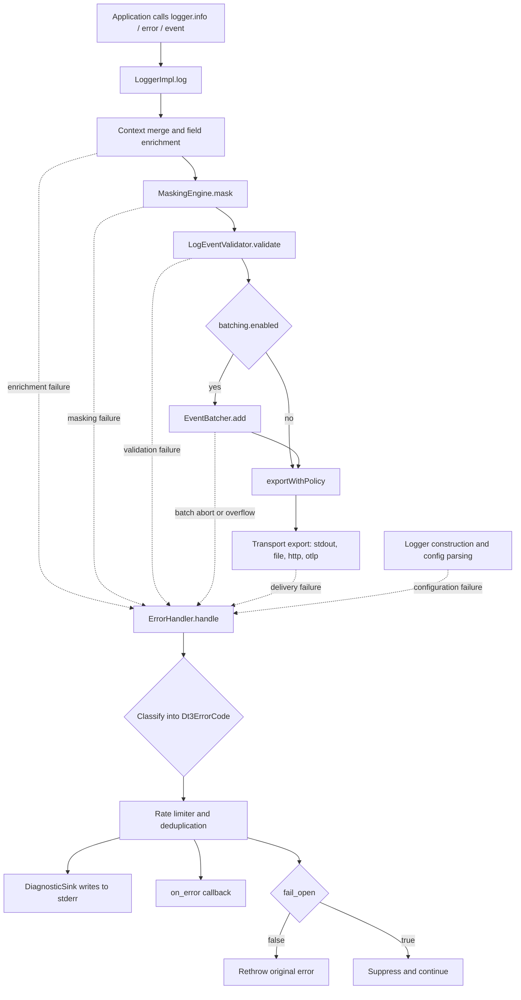
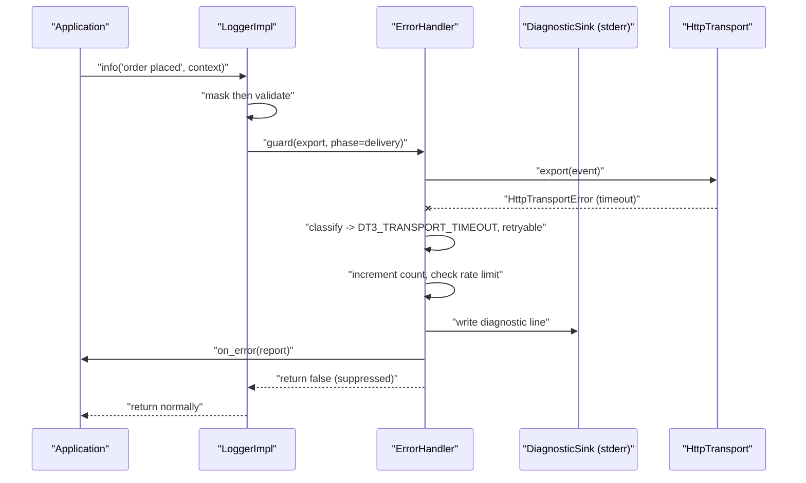

[CodeWiki](../../index.md) / [Forward-looking](../../Forward-looking/index.md) / [Specs](../index.md) / [Detailed Designs](index.md)

# DT3 Commons Error Handler — Detailed Design

## Overview

This document specifies a centralized **error handler** for the DT3 Commons Platform SDK. It describes what will be added, why it is needed, and exactly how it will be built in the Python (`packages/python/dt3_sdk`) and Node/TypeScript (`packages/node/src`) implementations.

The DT3 SDK today already contains error handling, but that handling is *distributed*: each transport defines its own exception class, configuration mistakes surface as bare `ValueError`/`Error`, validation failures raise a separate `ValidationError`, and the fail-open policy is applied at exactly one narrow point in the delivery path. There is no single component that classifies a failure, decides its disposition, records a diagnostic, or notifies the host application. The result is that a misconfigured or degraded logger can fail silently and indefinitely, which directly undermines the repository's own stated design principle of "Fail-Open by Default — Logging failures never break applications" (`README.md`). Failing open is correct; failing open *invisibly* is not.

The proposed error handler introduces a unified error taxonomy, a single `ErrorHandler` component that all failure paths route through, an out-of-band diagnostic channel that reports SDK-internal failures without recursing into the logger, and a user-facing `on_error` hook. It also adds framework-level error capture helpers so that application exceptions are recorded as canonical DT3 events with the schema's already-reserved `error.code` and `error.retryable` fields populated.

## Current State (Verified by Reading Source)

### The single fail-open choke point in Python

`packages/python/dt3_sdk/impl/logger_impl.py` funnels all export work through `_export_with_policy` → `_deliver`:

```python
def _export_with_policy(self, event: Dict[str, Any]) -> None:
    """Deliver one final event under the configured delivery failure policy."""
    self._deliver(lambda: self._export(event))

def _deliver(self, operation: Callable[[], None]) -> None:
    """Apply the configured delivery-only failure policy to one operation."""
    try:
        operation()
    except (OSError, RuntimeError, TypeError, ValueError):
        if not self.fail_open:
            raise
```

Three observations follow directly from this code. First, when `fail_open` is `True` (the default, set in `__init__` via `self.fail_open = self._require_boolean(self.config.get("fail_open", True), "fail_open")`), the exception is discarded with no record whatsoever — no counter, no stderr note, no callback. Second, the `except` clause is an explicit allow-list; `HttpTransportError` and `OtlpTransportError` are caught only because both subclass `RuntimeError`, so any future transport error that does not inherit from one of those four base classes will escape the policy entirely and propagate into caller code even in fail-open mode. Third, the policy is described in its own docstring as "delivery-only," which is accurate: it is invoked from `_export_with_policy`, `flush`, and `close`, and from nowhere else.

### Failures that bypass the policy entirely

The `_log` method performs masking and validation *before* reaching the batcher or `_export_with_policy`:

```python
masked_event, masked_fields = self.masking_engine.mask(log_event)
if masked_fields:
    masked_event["dt3.security.masked_fields"] = masked_fields

validation_result = self.validator.validate(
    masked_event,
    mode=self.validation_mode,
)
if not validation_result.valid:
    if validation_result.mode == "STRICT":
        raise ValidationError(...)
```

Because `MaskingEngine.mask` (`packages/python/dt3_sdk/masking.py`) performs unbounded recursion over caller-supplied structures via `_mask_value`, a deeply nested or cyclic context can raise `RecursionError` from inside a `logger.info(...)` call, and nothing in `_log` catches it. Likewise the STRICT-mode `ValidationError` is raised straight out of the logging call. Neither path consults `fail_open`. Construction is also unguarded: `LoggerImpl.__init__` calls `LogEventValidator()`, which reads `schemas/log-event.schema.json` off disk with `schema_path.open(encoding="utf-8")` (`packages/python/dt3_sdk/validation.py`), and it constructs `FileTransport`, whose `__init__` performs `self._path.parent.mkdir(parents=True, exist_ok=True)` and opens the file for append (`packages/python/dt3_sdk/file_transport.py`). Both can raise `OSError` before any logger exists to report the problem.

### Silent loss inside the batcher

`packages/python/dt3_sdk/batching.py` deliberately drops errors raised on its own timer thread:

```python
def _flush_from_timer(self) -> None:
    """Flush due events without leaking timer-thread delivery exceptions."""
    with self._lock:
        self._timer = None
        if self._closed or not self._events:
            return

    try:
        self.flush()
    except Exception:
        # The logger's configured delivery policy is applied by its callback.
        # Fail-closed failures abort the batcher; fail-open callbacks do not
        # raise, so their normal delivery lifecycle continues.
        return
```

Suppressing the exception on a daemon timer thread is the right call, since an escaping exception there would be unhandleable. But combined with `_abort_after_delivery_failure`, which sets `self._aborted = True` and clears `self._events`, a fail-closed batcher can enter a permanent terminal state in which every subsequent `flush()` returns immediately at `if self._aborted: return` and every buffered event is discarded — with no signal to the application that logging has stopped.

### The Node divergence

`packages/node/src/sdk/impl/LoggerImpl.ts` implements the same policy but with a materially different catch surface:

```typescript
private handleDeliveryFailure(error: unknown): void {
  if (!this.failOpen) {
    throw error;
  }
}

private exportWithPolicy(event: LogEvent): void {
  try {
    this.export(event);
  } catch (deliveryError) {
    this.handleDeliveryFailure(deliveryError);
  }
}
```

Unlike Python's typed allow-list, this catches every thrown value. That is more robust against unexpected error types but less discriminating: a genuine programming defect such as a `TypeError` from a malformed event is treated identically to a network timeout. The asynchronous HTTP path compounds this. `HttpTransport.export` in `packages/node/src/sdk/HttpTransport.ts` is synchronous by signature but starts an asynchronous request, registering a promise in an `inFlight` set and attaching `void delivery.finally(...).catch(() => undefined)`. The rejection is therefore observed only if the application later calls `flush()`, which collects `Promise.allSettled(pending)` and rethrows the first rejection. An application that never flushes never learns that any HTTP export failed. `FileTransport.export` in Node calls `mkdirSync`/`appendFileSync` on every single event with no caching and no `close()` method at all, so a permissions failure repeats per event with no rate limiting.

### What the schema already reserves but nothing populates

`schemas/log-event.schema.json` defines five error fields:

```json
"error.type":      { "type": "string",  "description": "Error class/type name" },
"error.message":   { "type": "string",  "description": "Error message" },
"error.stack":     { "type": "string",  "description": "Error stack trace" },
"error.code":      { "type": "string",  "description": "Application-specific error code" },
"error.retryable": { "type": "boolean", "description": "Whether the error is retryable" }
```

Both implementations populate only the first three. In Python:

```python
if error is not None:
    log_event["error.type"] = type(error).__name__
    log_event["error.message"] = str(error)
    if error.__traceback__ is not None:
        log_event["error.stack"] = "".join(
            traceback.format_exception(type(error), error, error.__traceback__)
        )
```

and in Node, `logEvent['error.type'] = error.name; logEvent['error.message'] = error.message; logEvent['error.stack'] = error.stack;`. `error.code` and `error.retryable` are declared in `packages/node/src/api/types.ts` on the `LogEvent` interface but are never written by the SDK. The error handler will make these first-class.

### Summary of gaps

| Gap | Evidence | Consequence |
|---|---|---|
| Fail-open discards errors with zero record | `LoggerImpl._deliver` except clause has an empty body when `fail_open` | Logging can be fully broken and undetectable |
| Python catch list is a fixed allow-list | `except (OSError, RuntimeError, TypeError, ValueError)` | Novel error types escape the policy |
| Node catches everything untyped | `catch (deliveryError)` | Programming defects masked as transport noise |
| Masking/validation errors bypass policy | `_log` calls `mask`/`validate` outside `_deliver` | `RecursionError`/`ValidationError` reach the caller |
| Construction errors are unguarded | `LogEventValidator.__init__`, `FileTransport.__init__` | `create_logger` can throw at startup |
| Async HTTP rejections need an explicit flush | `HttpTransport.export` `.catch(() => undefined)` | Silent drop when the app never flushes |
| Batcher abort is terminal and silent | `EventBatcher._abort_after_delivery_failure` | Permanent event loss with no signal |
| No error classification vocabulary | Four unrelated exception classes | Cannot route, count, or rate-limit by cause |
| `error.code` / `error.retryable` unused | Schema vs. `_log` implementation | Downstream consumers cannot triage |
| No application-facing capture helper | No middleware in `integrations/**` (READMEs are stubs) | Every service reimplements error logging |

## Goals and Non-Goals

The error handler must guarantee that no SDK-internal failure is discarded without a record, while preserving the existing fail-open default so that adding it cannot break a running service. It must classify every failure into a stable taxonomy with a machine-readable code and a retryability judgement, and it must expose that judgement through the `error.code` and `error.retryable` fields the canonical schema already reserves. It must offer applications a supported way to observe SDK health, both passively through an out-of-band diagnostic stream and actively through a callback hook. It must behave identically across Python and Node, since `docs/cross-language-contract.md` is a stated repository contract. Finally, every new behaviour must be opt-in or default-compatible: an existing caller that passes only `service.name`, `service.version`, `deployment.environment`, and `exporter` must observe unchanged output.

Explicitly out of scope for this design: automatic retry or exponential backoff on transport failures, on-disk dead-letter queueing of undelivered events, circuit breaking with automatic recovery, and any change to the Java API surface under `packages/java`. These are noted as follow-on work.

## Architecture

The error handler sits beside the event pipeline rather than inside it. Every stage that can fail reports to the handler, and the handler alone decides between swallow, record, notify, and rethrow.



Three properties of this arrangement matter. The handler is invoked from the *stage boundaries*, so a failure is always attributed to a known phase rather than to an anonymous stack. The diagnostic sink writes directly to `stderr` and never calls back into `LoggerImpl`, which structurally prevents the recursive-failure loop that would otherwise occur when the logger tries to log its own export failure. And the fail-open decision remains the last step, so the existing contract is preserved byte-for-byte for callers who configure nothing new.

## Component 1: Error Taxonomy

### New file — `packages/python/dt3_sdk/errors.py`

A single base class with a stable string code and a retryability flag replaces the current situation in which callers must know four unrelated class names. `Dt3Error` extends `RuntimeError` deliberately: `LoggerImpl._deliver` already catches `RuntimeError`, so the new hierarchy is caught by the existing policy from the moment it is introduced, before any call-site edits land.

```python
"""Canonical error taxonomy for the DT3 Commons Python SDK."""

from __future__ import annotations

from enum import Enum
from typing import Any, Mapping, Optional


class Dt3ErrorCode(str, Enum):
    """Stable, machine-readable classification for every SDK-internal failure."""

    CONFIGURATION_INVALID = "DT3_CONFIG_INVALID"
    EXPORTER_UNSUPPORTED = "DT3_EXPORTER_UNSUPPORTED"
    TRANSPORT_UNAVAILABLE = "DT3_TRANSPORT_UNAVAILABLE"
    TRANSPORT_TIMEOUT = "DT3_TRANSPORT_TIMEOUT"
    TRANSPORT_REJECTED = "DT3_TRANSPORT_REJECTED"
    TRANSPORT_CLOSED = "DT3_TRANSPORT_CLOSED"
    SERIALIZATION_FAILED = "DT3_SERIALIZATION_FAILED"
    MASKING_FAILED = "DT3_MASKING_FAILED"
    VALIDATION_FAILED = "DT3_VALIDATION_FAILED"
    BATCH_OVERFLOW = "DT3_BATCH_OVERFLOW"
    BATCH_ABORTED = "DT3_BATCH_ABORTED"
    LIFECYCLE_CLOSED = "DT3_LIFECYCLE_CLOSED"
    UNKNOWN = "DT3_UNKNOWN"


class Dt3ErrorPhase(str, Enum):
    """Pipeline stage that produced a failure."""

    CONFIGURATION = "configuration"
    ENRICHMENT = "enrichment"
    MASKING = "masking"
    VALIDATION = "validation"
    BATCHING = "batching"
    DELIVERY = "delivery"
    LIFECYCLE = "lifecycle"


class Dt3Error(RuntimeError):
    """Base class for all DT3 SDK-internal errors.

    Inheriting from RuntimeError keeps every subclass inside the existing
    ``LoggerImpl._deliver`` except clause during incremental rollout.
    """

    code: Dt3ErrorCode = Dt3ErrorCode.UNKNOWN
    retryable: bool = False
    phase: Dt3ErrorPhase = Dt3ErrorPhase.DELIVERY

    def __init__(
        self,
        message: str,
        *,
        code: Optional[Dt3ErrorCode] = None,
        retryable: Optional[bool] = None,
        phase: Optional[Dt3ErrorPhase] = None,
        details: Optional[Mapping[str, Any]] = None,
    ) -> None:
        super().__init__(message)
        if code is not None:
            self.code = code
        if retryable is not None:
            self.retryable = retryable
        if phase is not None:
            self.phase = phase
        # Details must never contain caller-supplied event values; the
        # validation module already establishes this sanitization rule.
        self.details: dict[str, Any] = dict(details or {})

    def to_fields(self) -> dict[str, Any]:
        """Return canonical schema fields describing this error."""
        return {
            "error.type": type(self).__name__,
            "error.message": str(self),
            "error.code": self.code.value,
            "error.retryable": self.retryable,
        }


class Dt3ConfigurationError(Dt3Error, ValueError):
    """Invalid SDK configuration detected during logger construction."""

    code = Dt3ErrorCode.CONFIGURATION_INVALID
    retryable = False
    phase = Dt3ErrorPhase.CONFIGURATION


class Dt3TransportError(Dt3Error):
    """A transport could not deliver an event."""

    code = Dt3ErrorCode.TRANSPORT_UNAVAILABLE
    retryable = True
    phase = Dt3ErrorPhase.DELIVERY


class Dt3TimeoutError(Dt3TransportError):
    """A transport exceeded its configured request timeout."""

    code = Dt3ErrorCode.TRANSPORT_TIMEOUT
    retryable = True


class Dt3SerializationError(Dt3Error, TypeError):
    """A final event could not be serialized for export."""

    code = Dt3ErrorCode.SERIALIZATION_FAILED
    retryable = False
    phase = Dt3ErrorPhase.DELIVERY


class Dt3MaskingError(Dt3Error):
    """The masking engine could not process a supplied context."""

    code = Dt3ErrorCode.MASKING_FAILED
    retryable = False
    phase = Dt3ErrorPhase.MASKING


class Dt3LifecycleError(Dt3Error):
    """An operation was attempted on a closed logger, transport, or batcher."""

    code = Dt3ErrorCode.LIFECYCLE_CLOSED
    retryable = False
    phase = Dt3ErrorPhase.LIFECYCLE
```

`Dt3ConfigurationError` inherits from both `Dt3Error` and `ValueError` so that existing tests asserting `pytest.raises(ValueError)` against invalid configuration continue to pass unchanged. `Dt3SerializationError` uses the same trick with `TypeError`, which is what `json.dumps` raises today and what the transport docstrings promise.

### Reconciling the existing exception classes

`HttpTransportError` and `OtlpTransportError` are exported from `dt3_sdk/__init__.py` and are therefore part of the public API. They will be re-parented rather than removed, so no import breaks:

```diff
--- a/packages/python/dt3_sdk/http_transport.py
+++ b/packages/python/dt3_sdk/http_transport.py
-class HttpTransportError(RuntimeError):
-    """Raised when the HTTP transport cannot successfully export an event."""
+from .errors import Dt3ErrorCode, Dt3TransportError
+
+
+class HttpTransportError(Dt3TransportError):
+    """Raised when the HTTP transport cannot successfully export an event."""
+
+    code = Dt3ErrorCode.TRANSPORT_UNAVAILABLE
+    retryable = True
```

Because `Dt3TransportError` extends `Dt3Error` extends `RuntimeError`, every existing `except RuntimeError` and `except HttpTransportError` site keeps working. The two raise sites inside `HttpTransport.export` that currently produce a bare status message will additionally set a precise code — `Dt3ErrorCode.TRANSPORT_REJECTED` for the `HTTPError` branch, `Dt3ErrorCode.TRANSPORT_TIMEOUT` for the `TimeoutError` branch — and mark 4xx responses as non-retryable while 5xx and connection failures remain retryable. `OtlpTransportError` in `otlp_transport.py` receives the identical treatment.

`ValidationError` in `validation.py` currently extends `ValueError`. It will become `class ValidationError(Dt3Error, ValueError)` with `code = Dt3ErrorCode.VALIDATION_FAILED`, `retryable = False`, and `phase = Dt3ErrorPhase.VALIDATION`, preserving its `ValueError` identity for existing STRICT-mode tests.

### New file — `packages/node/src/sdk/errors.ts`

```typescript
/**
 * Stable, machine-readable classification for every SDK-internal failure.
 */
export enum Dt3ErrorCode {
  ConfigurationInvalid = 'DT3_CONFIG_INVALID',
  ExporterUnsupported = 'DT3_EXPORTER_UNSUPPORTED',
  TransportUnavailable = 'DT3_TRANSPORT_UNAVAILABLE',
  TransportTimeout = 'DT3_TRANSPORT_TIMEOUT',
  TransportRejected = 'DT3_TRANSPORT_REJECTED',
  TransportClosed = 'DT3_TRANSPORT_CLOSED',
  SerializationFailed = 'DT3_SERIALIZATION_FAILED',
  MaskingFailed = 'DT3_MASKING_FAILED',
  ValidationFailed = 'DT3_VALIDATION_FAILED',
  BatchOverflow = 'DT3_BATCH_OVERFLOW',
  BatchAborted = 'DT3_BATCH_ABORTED',
  LifecycleClosed = 'DT3_LIFECYCLE_CLOSED',
  Unknown = 'DT3_UNKNOWN',
}

/** Pipeline stage that produced a failure. */
export enum Dt3ErrorPhase {
  Configuration = 'configuration',
  Enrichment = 'enrichment',
  Masking = 'masking',
  Validation = 'validation',
  Batching = 'batching',
  Delivery = 'delivery',
  Lifecycle = 'lifecycle',
}

/** Base class for all DT3 SDK-internal errors. */
export class Dt3Error extends Error {
  public readonly code: Dt3ErrorCode;
  public readonly retryable: boolean;
  public readonly phase: Dt3ErrorPhase;
  public readonly details: Readonly<Record<string, unknown>>;

  constructor(
    message: string,
    options: {
      code?: Dt3ErrorCode;
      retryable?: boolean;
      phase?: Dt3ErrorPhase;
      details?: Record<string, unknown>;
      cause?: unknown;
    } = {},
  ) {
    super(message);
    this.name = new.target.name;
    this.code = options.code ?? Dt3ErrorCode.Unknown;
    this.retryable = options.retryable ?? false;
    this.phase = options.phase ?? Dt3ErrorPhase.Delivery;
    this.details = Object.freeze({ ...(options.details ?? {}) });
    if (options.cause !== undefined) {
      (this as { cause?: unknown }).cause = options.cause;
    }
    Object.setPrototypeOf(this, new.target.prototype);
  }

  /** Return canonical schema fields describing this error. */
  public toFields(): Record<string, unknown> {
    return {
      'error.type': this.name,
      'error.message': this.message,
      'error.code': this.code,
      'error.retryable': this.retryable,
    };
  }
}

export class Dt3ConfigurationError extends Dt3Error {
  constructor(message: string, details?: Record<string, unknown>) {
    super(message, {
      code: Dt3ErrorCode.ConfigurationInvalid,
      retryable: false,
      phase: Dt3ErrorPhase.Configuration,
      details,
    });
  }
}

export class Dt3TransportError extends Dt3Error {
  constructor(
    message: string,
    options: { code?: Dt3ErrorCode; retryable?: boolean; cause?: unknown } = {},
  ) {
    super(message, {
      code: options.code ?? Dt3ErrorCode.TransportUnavailable,
      retryable: options.retryable ?? true,
      phase: Dt3ErrorPhase.Delivery,
      cause: options.cause,
    });
  }
}

export class Dt3LifecycleError extends Dt3Error {
  constructor(message: string) {
    super(message, {
      code: Dt3ErrorCode.LifecycleClosed,
      retryable: false,
      phase: Dt3ErrorPhase.Lifecycle,
    });
  }
}
```

The explicit `Object.setPrototypeOf(this, new.target.prototype)` call is required because the Node package compiles through `tsc` (`packages/node/package.json` build script) and `instanceof` checks against subclassed `Error` break under ES5-targeted output without it. `HttpTransportError` in `HttpTransport.ts` will be redeclared as `class HttpTransportError extends Dt3TransportError`, retaining `this.name = 'HttpTransportError'` so that existing assertions on the name string continue to hold.

### Error code reference

| Code | Retryable | Phase | Typical trigger |
|---|---|---|---|
| `DT3_CONFIG_INVALID` | no | configuration | Non-boolean `fail_open`, non-numeric `batching.max_size`, blank `exporter.file.path` |
| `DT3_EXPORTER_UNSUPPORTED` | no | configuration | `exporter` not in stdout / file / http / otlp |
| `DT3_TRANSPORT_UNAVAILABLE` | yes | delivery | `URLError`, socket error, DNS failure |
| `DT3_TRANSPORT_TIMEOUT` | yes | delivery | `TimeoutError`, Node request `timeout` event |
| `DT3_TRANSPORT_REJECTED` | 5xx yes / 4xx no | delivery | Non-2xx HTTP or OTLP response |
| `DT3_TRANSPORT_CLOSED` | no | lifecycle | Export attempted after `close()` |
| `DT3_SERIALIZATION_FAILED` | no | delivery | `json.dumps` / `JSON.stringify` raises |
| `DT3_MASKING_FAILED` | no | masking | `RecursionError` on cyclic or deep context |
| `DT3_VALIDATION_FAILED` | no | validation | STRICT-mode schema violation |
| `DT3_BATCH_OVERFLOW` | no | batching | Buffer exceeded the configured hard cap |
| `DT3_BATCH_ABORTED` | no | batching | `EventBatcher` entered its `_aborted` state |
| `DT3_LIFECYCLE_CLOSED` | no | lifecycle | Log or flush attempted on a closed logger |
| `DT3_UNKNOWN` | no | delivery | Anything unclassified |

## Component 2: The ErrorHandler

### New file — `packages/python/dt3_sdk/error_handler.py`

```python
"""Centralized failure handling for the DT3 Commons Python SDK."""

from __future__ import annotations

import sys
import threading
import time
import traceback
from typing import Any, Callable, Mapping, Optional, TextIO

from .errors import Dt3Error, Dt3ErrorCode, Dt3ErrorPhase

OnErrorCallback = Callable[["Dt3ErrorReport"], None]


class Dt3ErrorReport:
    """An immutable, sanitized description of one handled SDK failure."""

    __slots__ = ("code", "phase", "message", "retryable", "error", "occurrences")

    def __init__(
        self,
        code: Dt3ErrorCode,
        phase: Dt3ErrorPhase,
        message: str,
        retryable: bool,
        error: BaseException,
        occurrences: int,
    ) -> None:
        self.code = code
        self.phase = phase
        self.message = message
        self.retryable = retryable
        self.error = error
        self.occurrences = occurrences

    def to_fields(self) -> dict[str, Any]:
        """Return canonical schema fields describing this report."""
        return {
            "error.type": type(self.error).__name__,
            "error.message": self.message,
            "error.code": self.code.value,
            "error.retryable": self.retryable,
        }


class ErrorHandler:
    """Classify, record, and dispose of every SDK-internal failure.

    The handler never calls back into LoggerImpl. Diagnostics are written to an
    independent stream so a broken exporter cannot trigger recursive failure.
    """

    def __init__(
        self,
        *,
        fail_open: bool = True,
        diagnostics_enabled: bool = True,
        diagnostics_stream: Optional[TextIO] = None,
        include_stack: bool = False,
        rate_limit_per_minute: int = 20,
        on_error: Optional[OnErrorCallback] = None,
    ) -> None:
        """Create an error handler.

        Args:
            fail_open: When True, handled errors are suppressed after recording.
            diagnostics_enabled: Whether to emit out-of-band diagnostic lines.
            diagnostics_stream: Destination for diagnostics; defaults to stderr.
            include_stack: Whether diagnostics include a formatted traceback.
            rate_limit_per_minute: Maximum diagnostics per error code per minute.
            on_error: Optional application callback invoked for each report.

        Raises:
            Dt3ConfigurationError: If rate_limit_per_minute is not a positive int.
        """
        from .errors import Dt3ConfigurationError

        if isinstance(rate_limit_per_minute, bool) or not isinstance(
            rate_limit_per_minute, int
        ) or rate_limit_per_minute <= 0:
            raise Dt3ConfigurationError(
                "error.rate_limit_per_minute must be a positive integer"
            )

        self._fail_open = fail_open
        self._diagnostics_enabled = diagnostics_enabled
        self._stream = diagnostics_stream if diagnostics_stream is not None else sys.stderr
        self._include_stack = include_stack
        self._rate_limit = rate_limit_per_minute
        self._on_error = on_error
        self._lock = threading.Lock()
        self._counts: dict[Dt3ErrorCode, int] = {}
        self._window_start: dict[Dt3ErrorCode, float] = {}
        self._window_emitted: dict[Dt3ErrorCode, int] = {}

    # PUBLIC_INTERFACE
    def handle(
        self,
        error: BaseException,
        *,
        phase: Dt3ErrorPhase,
        context: Optional[Mapping[str, str]] = None,
    ) -> None:
        """Record one failure and apply the configured disposition policy.

        Args:
            error: The originating exception.
            phase: Pipeline stage in which the failure occurred.
            context: Optional non-sensitive labels such as the exporter name.

        Raises:
            BaseException: The original error, re-raised when fail_open is False.
        """
        code, retryable = self.classify(error)
        with self._lock:
            self._counts[code] = self._counts.get(code, 0) + 1
            occurrences = self._counts[code]
            should_emit = self._allow_emission_locked(code)

        report = Dt3ErrorReport(
            code=code,
            phase=phase,
            message=str(error),
            retryable=retryable,
            error=error,
            occurrences=occurrences,
        )

        if self._diagnostics_enabled and should_emit:
            self._write_diagnostic(report, context or {})

        if self._on_error is not None:
            try:
                self._on_error(report)
            except Exception:
                # A faulty application callback must never escalate into the
                # logging path, and must never be reported through itself.
                pass

        if not self._fail_open:
            raise error

    # PUBLIC_INTERFACE
    def guard(
        self,
        operation: Callable[[], None],
        *,
        phase: Dt3ErrorPhase,
        context: Optional[Mapping[str, str]] = None,
    ) -> bool:
        """Run an operation under the handler policy.

        Returns:
            True when the operation completed, False when it failed and the
            handler suppressed the error.
        """
        try:
            operation()
            return True
        except BaseException as error:  # noqa: BLE001 - deliberate boundary
            if isinstance(error, (KeyboardInterrupt, SystemExit, MemoryError)):
                raise
            self.handle(error, phase=phase, context=context)
            return False

    # PUBLIC_INTERFACE
    def classify(self, error: BaseException) -> tuple[Dt3ErrorCode, bool]:
        """Map an arbitrary exception onto the canonical taxonomy."""
        if isinstance(error, Dt3Error):
            return error.code, error.retryable
        if isinstance(error, TimeoutError):
            return Dt3ErrorCode.TRANSPORT_TIMEOUT, True
        if isinstance(error, RecursionError):
            return Dt3ErrorCode.MASKING_FAILED, False
        if isinstance(error, TypeError):
            return Dt3ErrorCode.SERIALIZATION_FAILED, False
        if isinstance(error, OSError):
            return Dt3ErrorCode.TRANSPORT_UNAVAILABLE, True
        if isinstance(error, ValueError):
            return Dt3ErrorCode.CONFIGURATION_INVALID, False
        if isinstance(error, RuntimeError):
            return Dt3ErrorCode.LIFECYCLE_CLOSED, False
        return Dt3ErrorCode.UNKNOWN, False

    # PUBLIC_INTERFACE
    def snapshot(self) -> dict[str, int]:
        """Return cumulative handled-error counts keyed by error code."""
        with self._lock:
            return {code.value: count for code, count in self._counts.items()}

    def _allow_emission_locked(self, code: Dt3ErrorCode) -> bool:
        """Apply per-code, per-minute diagnostic rate limiting."""
        now = time.monotonic()
        window_start = self._window_start.get(code)
        if window_start is None or now - window_start >= 60.0:
            self._window_start[code] = now
            self._window_emitted[code] = 1
            return True
        if self._window_emitted[code] < self._rate_limit:
            self._window_emitted[code] += 1
            return True
        return False

    def _write_diagnostic(
        self,
        report: Dt3ErrorReport,
        context: Mapping[str, str],
    ) -> None:
        """Write one out-of-band diagnostic line, never raising."""
        labels = " ".join(f"{key}={value}" for key, value in sorted(context.items()))
        line = (
            f"[dt3-sdk] level=error code={report.code.value} "
            f"phase={report.phase.value} retryable={str(report.retryable).lower()} "
            f"occurrences={report.occurrences} "
            f"type={type(report.error).__name__} message={report.message!r}"
        )
        if labels:
            line = f"{line} {labels}"
        try:
            self._stream.write(f"{line}\n")
            if self._include_stack and report.error.__traceback__ is not None:
                self._stream.write(
                    "".join(
                        traceback.format_exception(
                            type(report.error),
                            report.error,
                            report.error.__traceback__,
                        )
                    )
                )
            self._stream.flush()
        except Exception:
            # Diagnostics are best-effort by definition; a broken stderr must
            # not convert a suppressed logging failure into an application crash.
            pass
```

Several decisions in this class are load-bearing. `guard` re-raises `KeyboardInterrupt`, `SystemExit`, and `MemoryError` before consulting the policy, because suppressing those would make a service unkillable or mask genuine exhaustion — a hazard the current Node `catch (deliveryError)` does have. The `on_error` callback is itself wrapped in a bare `except` with a `pass`, because a callback that throws while reporting an error would otherwise produce infinite recursion. Rate limiting is per-code rather than global so that a flood of `DT3_TRANSPORT_TIMEOUT` cannot hide a single `DT3_CONFIG_INVALID`. And `_write_diagnostic` swallows its own failures for the same reason the diagnostic sink is separate from the logger in the first place.

### New file — `packages/node/src/sdk/ErrorHandler.ts`

```typescript
import { Dt3Error, Dt3ErrorCode, Dt3ErrorPhase } from './errors';

/** An immutable, sanitized description of one handled SDK failure. */
export interface Dt3ErrorReport {
  readonly code: Dt3ErrorCode;
  readonly phase: Dt3ErrorPhase;
  readonly message: string;
  readonly retryable: boolean;
  readonly error: unknown;
  readonly occurrences: number;
}

export type OnErrorCallback = (report: Dt3ErrorReport) => void;

export interface ErrorHandlerOptions {
  failOpen?: boolean;
  diagnosticsEnabled?: boolean;
  diagnosticsWrite?: (line: string) => void;
  includeStack?: boolean;
  rateLimitPerMinute?: number;
  onError?: OnErrorCallback;
}

/**
 * Classify, record, and dispose of every SDK-internal failure.
 *
 * Diagnostics are written through an injected sink that defaults to
 * `process.stderr`, so a failing exporter can never trigger recursion.
 */
export class ErrorHandler {
  private readonly failOpen: boolean;
  private readonly diagnosticsEnabled: boolean;
  private readonly write: (line: string) => void;
  private readonly includeStack: boolean;
  private readonly rateLimitPerMinute: number;
  private readonly onError?: OnErrorCallback;
  private readonly counts = new Map<Dt3ErrorCode, number>();
  private readonly windowStart = new Map<Dt3ErrorCode, number>();
  private readonly windowEmitted = new Map<Dt3ErrorCode, number>();

  constructor(options: ErrorHandlerOptions = {}) {
    this.failOpen = options.failOpen ?? true;
    this.diagnosticsEnabled = options.diagnosticsEnabled ?? true;
    this.write = options.diagnosticsWrite ?? ((line) => process.stderr.write(line));
    this.includeStack = options.includeStack ?? false;
    this.rateLimitPerMinute = options.rateLimitPerMinute ?? 20;
    this.onError = options.onError;
  }

  /**
   * Record one failure and apply the configured disposition policy.
   *
   * @throws The original error when the handler is configured to fail closed.
   */
  public handle(error: unknown, phase: Dt3ErrorPhase, context: Record<string, string> = {}): void {
    const { code, retryable } = this.classify(error);
    const occurrences = (this.counts.get(code) ?? 0) + 1;
    this.counts.set(code, occurrences);

    const report: Dt3ErrorReport = {
      code,
      phase,
      message: error instanceof Error ? error.message : String(error),
      retryable,
      error,
      occurrences,
    };

    if (this.diagnosticsEnabled && this.allowEmission(code)) {
      this.writeDiagnostic(report, context);
    }

    if (this.onError) {
      try {
        this.onError(report);
      } catch {
        // A faulty application callback must never escalate.
      }
    }

    if (!this.failOpen) {
      throw error;
    }
  }

  /**
   * Run a synchronous operation under the handler policy.
   *
   * @returns True when the operation completed, false when it was suppressed.
   */
  public guard(operation: () => void, phase: Dt3ErrorPhase, context: Record<string, string> = {}): boolean {
    try {
      operation();
      return true;
    } catch (error) {
      this.handle(error, phase, context);
      return false;
    }
  }

  /** Run an asynchronous operation under the handler policy. */
  public async guardAsync(
    operation: () => Promise<void>,
    phase: Dt3ErrorPhase,
    context: Record<string, string> = {},
  ): Promise<boolean> {
    try {
      await operation();
      return true;
    } catch (error) {
      this.handle(error, phase, context);
      return false;
    }
  }

  /** Map an arbitrary thrown value onto the canonical taxonomy. */
  public classify(error: unknown): { code: Dt3ErrorCode; retryable: boolean } {
    if (error instanceof Dt3Error) {
      return { code: error.code, retryable: error.retryable };
    }
    if (error instanceof TypeError) {
      return { code: Dt3ErrorCode.SerializationFailed, retryable: false };
    }
    if (error instanceof RangeError) {
      return { code: Dt3ErrorCode.MaskingFailed, retryable: false };
    }
    const nodeCode = (error as { code?: string } | null)?.code;
    if (nodeCode === 'ECONNREFUSED' || nodeCode === 'ENOTFOUND' || nodeCode === 'EPIPE') {
      return { code: Dt3ErrorCode.TransportUnavailable, retryable: true };
    }
    if (nodeCode === 'ETIMEDOUT' || nodeCode === 'ESOCKETTIMEDOUT') {
      return { code: Dt3ErrorCode.TransportTimeout, retryable: true };
    }
    if (nodeCode === 'EACCES' || nodeCode === 'ENOENT') {
      return { code: Dt3ErrorCode.TransportUnavailable, retryable: false };
    }
    return { code: Dt3ErrorCode.Unknown, retryable: false };
  }

  /** Return cumulative handled-error counts keyed by error code. */
  public snapshot(): Record<string, number> {
    return Object.fromEntries([...this.counts].map(([code, count]) => [code, count]));
  }

  private allowEmission(code: Dt3ErrorCode): boolean {
    const now = Date.now();
    const start = this.windowStart.get(code);
    if (start === undefined || now - start >= 60_000) {
      this.windowStart.set(code, now);
      this.windowEmitted.set(code, 1);
      return true;
    }
    const emitted = this.windowEmitted.get(code) ?? 0;
    if (emitted < this.rateLimitPerMinute) {
      this.windowEmitted.set(code, emitted + 1);
      return true;
    }
    return false;
  }

  private writeDiagnostic(report: Dt3ErrorReport, context: Record<string, string>): void {
    const labels = Object.entries(context)
      .sort(([left], [right]) => left.localeCompare(right))
      .map(([key, value]) => `${key}=${value}`)
      .join(' ');
    const type = report.error instanceof Error ? report.error.name : typeof report.error;
    let line =
      `[dt3-sdk] level=error code=${report.code} phase=${report.phase} ` +
      `retryable=${report.retryable} occurrences=${report.occurrences} ` +
      `type=${type} message=${JSON.stringify(report.message)}`;
    if (labels) {
      line = `${line} ${labels}`;
    }
    try {
      this.write(`${line}\n`);
      if (this.includeStack && report.error instanceof Error && report.error.stack) {
        this.write(`${report.error.stack}\n`);
      }
    } catch {
      // Diagnostics are best-effort.
    }
  }
}
```

The Node classifier inspects `error.code` string values because Node's `fs` and `net` layers signal failure through `NodeJS.ErrnoException` rather than through distinct classes. `RangeError` maps to `MaskingFailed` since that is what V8 throws for stack overflow, the Node analogue of Python's `RecursionError`. Note that `EACCES` and `ENOENT` are marked non-retryable while `ECONNREFUSED` is retryable, since the former reflect a durable misconfiguration.

## Component 3: Wiring Into the Logger

### Python — `packages/python/dt3_sdk/impl/logger_impl.py`

Construction gains a handler built before any transport, so that transport construction failures are themselves reportable:

```diff
--- a/packages/python/dt3_sdk/impl/logger_impl.py
+++ b/packages/python/dt3_sdk/impl/logger_impl.py
 from dt3_sdk.batching import EventBatcher
 from dt3_sdk.context import ensure_correlation_id, get_active_logger_context
+from dt3_sdk.error_handler import ErrorHandler
+from dt3_sdk.errors import Dt3ErrorPhase, Dt3MaskingError
 from dt3_sdk.file_transport import FileTransport
```

```diff
         self.fail_open = self._require_boolean(
             self.config.get("fail_open", True),
             "fail_open",
         )
+        self.error_handler = ErrorHandler(
+            fail_open=self.fail_open,
+            diagnostics_enabled=self._require_boolean(
+                self.config.get("error.diagnostics.enabled", True),
+                "error.diagnostics.enabled",
+            ),
+            include_stack=self._require_boolean(
+                self.config.get("error.include_stack", False),
+                "error.include_stack",
+            ),
+            rate_limit_per_minute=self.config.get(
+                "error.rate_limit_per_minute", 20
+            ),
+            on_error=self.config.get("error.on_error"),
+        )
         self.masking_engine = MaskingEngine(
```

The delivery policy is replaced so that classification, diagnostics, and notification all occur before the fail-open decision, and so that the narrow four-type allow-list is widened to every non-fatal exception:

```diff
     def _export_with_policy(self, event: Dict[str, Any]) -> None:
         """Deliver one final event under the configured delivery failure policy."""
-        self._deliver(lambda: self._export(event))
+        self._deliver(
+            lambda: self._export(event),
+            phase=Dt3ErrorPhase.DELIVERY,
+        )
 
-    def _deliver(self, operation: Callable[[], None]) -> None:
-        """Apply the configured delivery-only failure policy to one operation."""
-        try:
-            operation()
-        except (OSError, RuntimeError, TypeError, ValueError):
-            if not self.fail_open:
-                raise
+    def _deliver(
+        self,
+        operation: Callable[[], None],
+        *,
+        phase: Dt3ErrorPhase = Dt3ErrorPhase.DELIVERY,
+    ) -> None:
+        """Apply the configured failure policy to one operation.
+
+        Classification, diagnostics, and the on_error notification all occur
+        before the fail-open decision, so a suppressed failure is still
+        observable through the diagnostic stream and the handler snapshot.
+        """
+        self.error_handler.guard(
+            operation,
+            phase=phase,
+            context={"exporter": self.exporter},
+        )
```

Masking and validation are brought inside the policy. In `_log`, the masking call becomes:

```diff
-        masked_event, masked_fields = self.masking_engine.mask(log_event)
-        if masked_fields:
-            masked_event["dt3.security.masked_fields"] = masked_fields
+        try:
+            masked_event, masked_fields = self.masking_engine.mask(log_event)
+        except RecursionError as masking_error:
+            # A cyclic or pathologically deep caller context must not crash the
+            # application. The event is dropped after being reported.
+            self.error_handler.handle(
+                Dt3MaskingError(
+                    "masking failed for the supplied context",
+                ).with_traceback(masking_error.__traceback__),
+                phase=Dt3ErrorPhase.MASKING,
+                context={"exporter": self.exporter},
+            )
+            return
+        if masked_fields:
+            masked_event["dt3.security.masked_fields"] = masked_fields
```

and the STRICT-mode branch routes through the handler so that a strict validation failure is recorded and notified even when it is subsequently re-raised:

```diff
         if not validation_result.valid:
             if validation_result.mode == "STRICT":
-                raise ValidationError(
-                    "Log event failed schema validation: "
-                    + "; ".join(...)
-                )
+                validation_error = ValidationError(
+                    "Log event failed schema validation: "
+                    + "; ".join(
+                        (
+                            f"{detail.field}: {detail.message} "
+                            f"(rule: {detail.rule})"
+                        )
+                        for detail in validation_result.errors
+                    )
+                )
+                # STRICT mode is an explicit opt-in to fail closed on schema
+                # violations, so this always raises regardless of fail_open.
+                self.error_handler.handle(
+                    validation_error,
+                    phase=Dt3ErrorPhase.VALIDATION,
+                    context={"mode": "STRICT"},
+                )
+                raise validation_error
```

Note the deliberate asymmetry: STRICT mode raises unconditionally even under `fail_open=True`, because the current implementation behaves that way and because opting into STRICT is itself a declaration that schema violations are unacceptable. The handler call before the `raise` exists purely so the failure is counted and reported.

Finally a public accessor is added so applications can poll SDK health:

```python
    # PUBLIC_INTERFACE
    def error_snapshot(self) -> Dict[str, int]:
        """Return cumulative counts of handled SDK-internal errors by code.

        Returns:
            A mapping from DT3 error code to the number of times that failure
            class has been handled since this logger was created.
        """
        return self.error_handler.snapshot()
```

### Node — `packages/node/src/sdk/impl/LoggerImpl.ts`

```diff
 import { EventBatcher } from '../batching';
+import { ErrorHandler } from '../ErrorHandler';
+import { Dt3ErrorPhase } from '../errors';
 import { FileTransport } from '../FileTransport';
```

```diff
   private readonly batcher?: EventBatcher;
+  private readonly errorHandler: ErrorHandler;
   private closed = false;
```

```diff
     this.failOpen = this.requireBoolean(config.fail_open ?? true, 'fail_open');
+    this.errorHandler = new ErrorHandler({
+      failOpen: this.failOpen,
+      diagnosticsEnabled: config['error.diagnostics.enabled'] !== false,
+      includeStack: config['error.include_stack'] === true,
+      rateLimitPerMinute:
+        typeof config['error.rate_limit_per_minute'] === 'number'
+          ? config['error.rate_limit_per_minute']
+          : 20,
+      onError:
+        typeof config['error.on_error'] === 'function'
+          ? (config['error.on_error'] as OnErrorCallback)
+          : undefined,
+    });
```

```diff
-  private handleDeliveryFailure(error: unknown): void {
-    if (!this.failOpen) {
-      throw error;
-    }
-  }
-
-  private exportWithPolicy(event: LogEvent): void {
-    try {
-      this.export(event);
-    } catch (deliveryError) {
-      this.handleDeliveryFailure(deliveryError);
-    }
-  }
+  private handleDeliveryFailure(error: unknown): void {
+    this.errorHandler.handle(error, Dt3ErrorPhase.Delivery, { exporter: this.exporter });
+  }
+
+  private exportWithPolicy(event: LogEvent): void {
+    this.errorHandler.guard(() => this.export(event), Dt3ErrorPhase.Delivery, {
+      exporter: this.exporter,
+    });
+  }
```

The asynchronous HTTP gap is closed by giving `HttpTransport` an optional failure observer, so a rejected in-flight request is reported at rejection time rather than only at the next `flush()`:

```diff
--- a/packages/node/src/sdk/HttpTransport.ts
+++ b/packages/node/src/sdk/HttpTransport.ts
-  constructor(endpoint: string, timeoutMs = 5000, headers?: Headers) {
+  constructor(
+    endpoint: string,
+    timeoutMs = 5000,
+    headers?: Headers,
+    onDeliveryFailure?: (error: unknown) => void,
+  ) {
```

```diff
     this.inFlight.add(delivery);
-    void delivery.finally(() => this.inFlight.delete(delivery)).catch(() => undefined);
+    void delivery
+      .finally(() => this.inFlight.delete(delivery))
+      .catch((deliveryError: unknown) => {
+        // Report at rejection time so a service that never calls flush still
+        // observes export failures through the diagnostic channel.
+        this.onDeliveryFailure?.(deliveryError);
+      });
```

`LoggerImpl` passes `(error) => this.handleDeliveryFailure(error)` as the fourth argument. Because `handleDeliveryFailure` now delegates to `errorHandler.handle`, and because the promise is still retained in `inFlight` for `flush()` to observe, a fail-closed configuration continues to reject from `flush()` exactly as it does today while a fail-open configuration finally gains visibility.

### Batcher — surfacing the terminal abort

`EventBatcher` gains an optional `on_error` parameter so the silent `_flush_from_timer` return and the terminal `_aborted` state both become observable:

```diff
--- a/packages/python/dt3_sdk/batching.py
+++ b/packages/python/dt3_sdk/batching.py
     def _flush_from_timer(self) -> None:
         """Flush due events without leaking timer-thread delivery exceptions."""
         with self._lock:
             self._timer = None
             if self._closed or not self._events:
                 return
 
         try:
             self.flush()
-        except Exception:
-            return
+        except Exception as flush_error:
+            # The exception must not escape the daemon timer thread, but the
+            # handler still records it so the abort is not silent.
+            if self._on_error is not None:
+                self._on_error(flush_error, Dt3ErrorPhase.BATCHING)
+            return
```

and `add` reports discarded events once when the batcher is already aborted:

```diff
         with self._lock:
             if self._closed:
                 raise RuntimeError("Batcher is closed")
+            if self._aborted:
+                self._discarded += 1
+                if self._on_error is not None:
+                    self._on_error(
+                        Dt3Error(
+                            "event discarded: batcher aborted after a "
+                            "fail-closed delivery failure",
+                            code=Dt3ErrorCode.BATCH_ABORTED,
+                            phase=Dt3ErrorPhase.BATCHING,
+                        ),
+                        Dt3ErrorPhase.BATCHING,
+                    )
+                return
             self._events.append(dict(event))
```

The equivalent change applies to `packages/node/src/sdk/batching.ts`.

## Component 4: Populating `error.code` and `error.retryable`

The logger's error enrichment is extended so that a `Dt3Error` passed to `logger.error(...)` contributes its code and retryability, and so that plain exceptions may carry them through explicit context. In `_log`:

```diff
         if error is not None:
             log_event["error.type"] = type(error).__name__
             log_event["error.message"] = str(error)
+            if isinstance(error, Dt3Error):
+                log_event["error.code"] = error.code.value
+                log_event["error.retryable"] = error.retryable
+            else:
+                code = getattr(error, "code", None)
+                if isinstance(code, str):
+                    log_event["error.code"] = code
+                retryable = getattr(error, "retryable", None)
+                if isinstance(retryable, bool):
+                    log_event["error.retryable"] = retryable
             if error.__traceback__ is not None:
```

The `getattr` fallback is intentional: application exceptions frequently define a `code` attribute already, and honouring it costs nothing while making the reserved schema field useful without forcing applications onto the DT3 hierarchy. Because these fields are written before `self.masking_engine.mask(log_event)` runs, they participate in masking like every other field, and because the schema declares `error.code` as a string and `error.retryable` as a boolean, both type guards are required to avoid introducing LENIENT-mode validation noise.

## Component 5: Application-Facing Capture Helpers

The `integrations/` directory currently contains only stub READMEs, so there is no existing middleware to modify. The design therefore adds new adapter modules whose sole responsibility is to convert an unhandled application exception into one canonical DT3 `ERROR` event with full context already attached.

For Express, a new `integrations/node-express/src/errorMiddleware.ts` exposes a factory that returns a standard four-argument Express error handler. It reads correlation and tenant identifiers from the active scope rather than from the request, since `withLogContext` in `packages/node/src/sdk/context.ts` already establishes them, and it deliberately re-delegates to `next(error)` so that DT3 observes the failure without taking over the HTTP response:

```typescript
import { Logger } from '@digitalt3/commons';

/**
 * Create Express error middleware that records one canonical DT3 ERROR event.
 *
 * The middleware never terminates the response itself; it records the failure
 * and forwards to the next error handler so application semantics are unchanged.
 */
export function createErrorMiddleware(logger: Logger) {
  return function dt3ErrorMiddleware(
    error: Error,
    request: { method?: string; route?: { path?: string } },
    _response: unknown,
    next: (error: Error) => void,
  ): void {
    logger.error('Unhandled request error', error, {
      'event.name': 'REQUEST_FAILED',
      attributes: {
        'http.method': request.method ?? 'UNKNOWN',
        'http.route': request.route?.path ?? 'unknown',
      },
    });
    next(error);
  };
}
```

The FastAPI counterpart in `integrations/python-fastapi/error_handler.py` follows the same principle, registering an exception handler that logs and then re-raises so that FastAPI's own response handling remains authoritative. Both helpers use `event.name` values that satisfy the schema's `^[A-Z][A-Z0-9_]*$` pattern, which is a real constraint: `LoggerImpl._log` falls back to `"GENERIC_EVENT"` only when `event.name` is absent or non-string, not when it is present but malformed, so a lowercase name would produce a LENIENT-mode `dt3.validation.errors` entry on every failed request.

## Configuration Reference

All new keys are optional and default to behaviour indistinguishable from today's, except that diagnostics are on by default — which is the entire point of the change.

| Key | Type | Default | Meaning |
|---|---|---|---|
| `fail_open` | boolean | `true` | Existing key; now also drives the handler's disposition |
| `error.diagnostics.enabled` | boolean | `true` | Write out-of-band diagnostic lines to stderr |
| `error.include_stack` | boolean | `false` | Append a formatted traceback to each diagnostic |
| `error.rate_limit_per_minute` | integer | `20` | Maximum diagnostics per error code per minute |
| `error.on_error` | callable | none | Invoked with a `Dt3ErrorReport` for every handled failure |

A representative Python configuration:

```python
from dt3_sdk import create_logger

def on_sdk_error(report):
    metrics.increment("dt3.sdk.errors", tags={"code": report.code.value})

logger = create_logger({
    "service.name": "billing-api",
    "service.version": "2.3.1",
    "deployment.environment": "production",
    "exporter": "otlp",
    "otlp.endpoint": "https://collector.internal/v1/logs",
    "fail_open": True,
    "error.diagnostics.enabled": True,
    "error.rate_limit_per_minute": 10,
    "error.on_error": on_sdk_error,
})
```

and the Node equivalent:

```typescript
import { createLogger } from '@digitalt3/commons';

const logger = createLogger({
  'service.name': 'billing-api',
  'service.version': '2.3.1',
  'deployment.environment': 'production',
  exporter: 'http',
  'exporter.http.endpoint': 'https://collector.internal/logs',
  fail_open: true,
  'error.diagnostics.enabled': true,
  'error.rate_limit_per_minute': 10,
  'error.on_error': (report) => {
    metrics.increment('dt3.sdk.errors', { code: report.code });
  },
});
```

A sample diagnostic line, which is deliberately parseable by `logfmt`-style tooling and is never JSON so that it cannot be mistaken for a real DT3 event on stdout:

```
[dt3-sdk] level=error code=DT3_TRANSPORT_TIMEOUT phase=delivery retryable=true occurrences=3 type=HttpTransportError message='HTTP export request timed out' exporter=http
```

## Failure Disposition Matrix

| Failure | Phase | fail_open = true | fail_open = false |
|---|---|---|---|
| Invalid config at construction | configuration | Raise `Dt3ConfigurationError` (construction always fails closed) | Raise `Dt3ConfigurationError` |
| Unsupported exporter | configuration | Raise `Dt3ConfigurationError` | Raise `Dt3ConfigurationError` |
| `RecursionError` in masking | masking | Report, drop the event, return | Report, then re-raise |
| STRICT validation failure | validation | Report, then raise `ValidationError` | Report, then raise `ValidationError` |
| LENIENT validation failure | validation | Attach `dt3.validation.errors`, no handler call | Same |
| Transport connection failure | delivery | Report, suppress | Report, re-raise |
| Transport timeout | delivery | Report, suppress | Report, re-raise |
| Non-2xx response | delivery | Report, suppress | Report, re-raise |
| Serialization failure | delivery | Report, suppress | Report, re-raise |
| Batch timer-thread flush failure | batching | Report, suppress | Report, suppress on the timer thread; abort state surfaces on next `flush` |
| Event added to aborted batcher | batching | Report once per event, discard | Report, discard |
| Log or flush after `close()` | lifecycle | Raise `Dt3LifecycleError` | Raise `Dt3LifecycleError` |

Construction and lifecycle failures fail closed under both policies by design. `fail_open` is documented as governing *delivery*, and silently returning a non-functional logger from `create_logger` would be far more dangerous than throwing at startup, since the application would then be unable to distinguish a working logger from a broken one.

## Sequence: Transport Failure Under Fail-Open



The application's `info` call returns normally, exactly as it does today, but the failure has now been counted, written to stderr, and pushed to the application's metrics pipeline through `on_error`.

## Testing Plan

Unit tests for the handler itself belong in `packages/python/tests/test_error_handler.py` and `packages/node/tests/ErrorHandler.test.ts`, matching the existing test layout. They must cover classification of each taxonomy entry including the unclassified fallback, per-code rate limiting across a simulated window boundary, the guarantee that an `on_error` callback which itself throws does not propagate, the guarantee that `KeyboardInterrupt` and `SystemExit` are re-raised rather than suppressed by `guard`, and the guarantee that a diagnostic sink which raises on write does not convert a suppressed failure into a crash.

Integration tests belong alongside the existing logger tests. The critical assertions are that a fail-open logger with an unreachable HTTP endpoint returns normally from `info` while producing exactly one diagnostic line and one `on_error` report; that the same logger with `fail_open: false` raises; that a cyclic context produces a `DT3_MASKING_FAILED` report and drops the event without raising under fail-open; that `error.code` and `error.retryable` appear in the emitted event when a `Dt3Error` is passed to `logger.error`; and that a legacy configuration containing none of the new keys emits byte-identical stdout output to the pre-change implementation. That last test is the regression gate for the whole change.

Cross-language conformance fixtures live under `tests/cross-language/fixtures/`. A new fixture pair should assert that Python and Node produce the same `error.code` string for equivalent transport failures, since divergence there would silently break the cross-language contract.

## Rollout

The change is naturally staged. Adding `errors.py` and `errors.ts` with re-parented transport exceptions is behaviour-neutral and can land first, verified only by the existing suites. Adding `ErrorHandler` and `ErrorHandler.ts` as standalone, unwired components with their own tests can land second. Wiring `_deliver` and `exportWithPolicy` to the handler is the first behaviour change and should land third, defaulting diagnostics on; this is the step most likely to surface pre-existing production failures that were previously invisible, so it warrants a release note. Extending coverage to masking, validation, batching, and construction lands fourth. Populating `error.code` and `error.retryable` lands fifth. The integration middleware lands last, since it depends on nothing else and is purely additive.

## Follow-On Work

Retry with exponential backoff for failures classified as `retryable` is the natural next increment, and the taxonomy is designed to make it straightforward: the handler already returns a retryability judgement, and `EventBatcher` already owns a timer thread that could drive backoff. Dead-letter spooling of undelivered events to a local file, circuit breaking after a sustained run of `DT3_TRANSPORT_UNAVAILABLE`, and emitting handler counters as a periodic `DT3_SDK_HEALTH` event are all enabled by this design but deliberately excluded from it. The Java API surface under `packages/java/src/main/java/com/digitalt3/commons/api` should receive a matching `Dt3Error` hierarchy when its SDK implementation is written; it is contract-only today.

## Source Files Examined

The design above was derived by reading the following files in full. Files whose behaviour is described but which have not been read are noted nowhere in this document, because no such files exist: every claim made here is backed by an excerpt above.

`README.md`; `schemas/log-event.schema.json`; `packages/python/dt3_sdk/__init__.py`, `factory.py`, `impl/logger_impl.py`, `context.py`, `masking.py`, `validation.py`, `batching.py`, `timer.py`, `file_transport.py`, `http_transport.py`, `otlp_transport.py`; `packages/node/package.json`, `src/index.ts`, `src/api/Logger.ts`, `src/api/types.ts`, `src/sdk/factory.ts`, `src/sdk/impl/LoggerImpl.ts`, `src/sdk/validation.ts`, `src/sdk/FileTransport.ts`, `src/sdk/HttpTransport.ts`; `docs/architecture.md`; `integrations/node-express/README.md`; `integrations/python-fastapi/README.md`.

Two areas were **not** traced to the bottom and are flagged as unverified. The Node `EventBatcher` in `packages/node/src/sdk/batching.ts` and `OtlpTransport` in `packages/node/src/sdk/OtlpTransport.ts` were not read; the changes proposed for them are stated as mirroring their Python counterparts, and an implementer should read both before applying those specific diffs. The Java package under `packages/java` was likewise not read and is explicitly excluded from scope.
