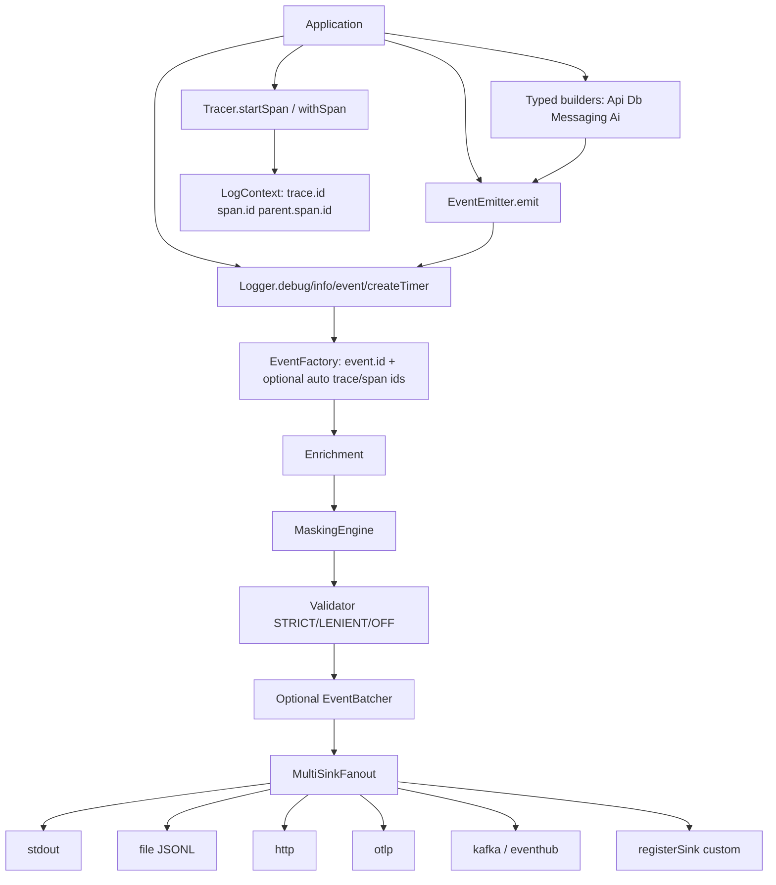

[CodeWiki](../../index.md) / [Specs](../index.md) / [Other](index.md)

# Structured Event Framework: Status vs Tech-Lead Proposal

## Purpose

This document tracks the DT3 Commons structured event framework against the recommended architecture (common contract, domain/AI event schemas, emitter pattern, pluggable sinks, OpenTelemetry alignment, and AI event hierarchy). It supersedes the earlier “gap analysis” snapshot; **implementation status below reflects the current repository**.

## Design decision (locked)

DT3 Commons implements the proposal as a **flat canonical `LogEvent`** (dot-separated, OTel-aligned JSON), not a nested C# `abstract record` hierarchy on the wire. Typed domain and AI events are **builders** that produce canonical maps. This preserves `schemas/log-event.schema.json`, OpenTelemetry naming, and cross-language parity (Python, Node, Java).

AI is a **first-class domain** in the same framework — not a separate AI logger.

## Architecture (current)

## Layer-by-layer status

### Layer 1: Common logging contract

| Proposed field | Canonical field | Status |
|---|---|---|
| EventId | `event.id` | Implemented (auto UUID when absent) |
| EventType | `event.name` | Implemented (UPPER_SNAKE_CASE) |
| Timestamp | `timestamp` | Implemented |
| CorrelationId | `correlation.id` | Implemented |
| OperationId | `operation.id` | Implemented |
| SessionId | `session.id` | Implemented |
| ServiceName | `service.name` | Implemented |
| ComponentName | `component.name` | Implemented |
| Tags | `attributes` (+ open additionalProperties) | Implemented |

Evidence: `schemas/log-event.schema.json` (1.1.0), `specs/events.yaml`, language `LogEvent` / LoggerImpl assembly.

### Layer 2: Event-specific contracts

| Domain | Status | Evidence |
|---|---|---|
| API / HTTP | Implemented | `specs/api-events.yaml`, `schemas/api-event.schema.json`, builders |
| Database | Implemented | `specs/database-events.yaml`, `schemas/database-event.schema.json`, builders |
| Messaging / workers | Implemented | `specs/messaging-events.yaml`, `schemas/messaging-event.schema.json`, builders |
| AI fields (provider, model, tokens, cost, latency, conversation/agent/request ids, finish reason, cache hit, temperature, max tokens, etc.) | Implemented | `specs/ai-events.yaml`, `schemas/ai-event.schema.json`, `kavia.*` builders |
| AI request / response split | Implemented | `AI_PROMPT_SUBMITTED` / `AI_RESPONSE_RECEIVED` + `kavia.request.id`; typed `build_ai_request_event` / `build_ai_response_event` helpers |
| AI hierarchy (prompt, response, tool, memory, RAG, agent, safety) | Implemented | Seven `event.name` values in AI spec/schema/builders |

### Layer 3: Emitter pattern

| Item | Status |
|---|---|
| `eventEmitter.Emit(eventObject)` | Implemented (`EventEmitter` in Python / Node / Java) |
| Avoid `LogAiEvent` / `LogApiEvent` anti-pattern | Implemented |
| Keep generic `Logger.event` | Implemented (unchanged contract) |

### Layer 4: Pluggable sinks

| Item | Status |
|---|---|
| Sink interface | Implemented (`EventSink` / Java `LogTransport`) |
| Fan-out + per-sink isolation | Implemented (`MultiSinkFanout`, `exporters[]`, `registerSink`) |
| stdout / file / HTTP / OTLP | Implemented |
| Kafka / Event Hub built-in sinks | Implemented (`kafka`, `eventhub` exporters) |
| Custom sinks without changing producers | Implemented |

### OpenTelemetry alignment

| Item | Status |
|---|---|
| `trace.id` / `span.id` / `parent.span.id` / `correlation.id` | Implemented |
| W3C inject/extract + scoped context | Implemented |
| In-SDK span creation (`startSpan` / `withSpan`) | Implemented |
| Span-event bridge (`span.addEvent`) | Implemented |
| Trace/span ids present on emitted events | Implemented (auto-generated when absent when `tracing.auto_generate_ids` is true, default true) |

## Specs and schemas inventory (framework)

| Artifact | Role |
|---|---|
| `specs/events.yaml`, `logging.yaml`, `tracing.yaml`, `config.yaml` | Core contracts |
| `specs/api-events.yaml`, `database-events.yaml`, `messaging-events.yaml`, `ai-events.yaml` | Domain contracts |
| `schemas/log-event.schema.json` | Runtime validation contract (1.1.0) |
| Domain `*-event.schema.json` | Attribute catalogs for builders |
| `schemas/event-envelope.schema.json` | Async messaging wrapper only (not the log pipeline) |

## Remaining / deferred items

These are **not** blockers for the tech-lead architecture; they are optional hardenings:

| Item | Notes |
|---|---|
| Nested C# abstract-record hierarchy on the wire | Intentionally not adopted; flat canonical maps are the cross-language contract |
| Async `WriteAsync` on every sink | Node HTTP/OTLP already settle async on flush; Java/Python remain sync write paths by design |
| Runtime validation against domain schemas | Domain schemas are catalogs; runtime validates `log-event.schema.json` |
| Event-type plugin registry | New typed domains still require builders/specs; data path is already open via `event()` / `emit()` |
| Full OTel Metrics/Traces SDK embedding | Spans are W3C-compatible in-SDK; no hard dependency on the full OTel SDK |

## Verification

Cross-language fixtures under `tests/cross-language/fixtures/` cover identity, API, and AI events. Per-language suites cover emitter, multi-sink isolation (including Kafka/Event Hub transports), AI request/response builders, masking of `kavia.prompt`/`kavia.response`, and span nesting.

## Conclusion

The reusable **Structured Event Framework** recommended by the tech lead is in place: common contract, specialized domain/AI schemas, emitter API, pluggable multi-sink export (including Kafka/Event Hub), and OTel-aligned trace/span participation — with AI as one first-class event family among API, database, messaging, and custom events.
