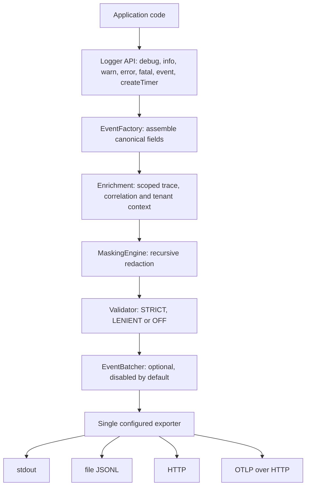

[CodeWiki](../../index.md) / [Specs](../index.md) / [Other](index.md)

# Structured Event Framework Proposal: Implementation Gap Analysis

## Purpose and Scope

This document records the observations from a source-code-level review of the `dt3-logger` repository (the DT3 Commons Platform SDK) against a proposed structured event framework design. The proposal recommends a layered design consisting of a common `LogEvent` base contract, event-specific contracts such as API, database and AI events, additional AI-specific telemetry fields, an emitter-based publication API, pluggable sinks, alignment with OpenTelemetry trace and span concepts, and a dedicated AI event hierarchy covering prompt submission, response reception, tool invocation, memory retrieval, retrieval-augmented generation, agent execution and safety filtering.

The scope of this review is strictly descriptive. Every statement below is derived from files that were read during the review, and the source evidence is cited inline. Where a conclusion could not be fully verified with the available tool budget, that limitation is stated explicitly in the section "Verification Coverage and Limitations". No source code was modified as part of this analysis.

## Executive Summary of Observations

The repository already implements a substantial portion of the proposed architecture, but it does so with a different shape than the proposal assumes. Rather than a class hierarchy of records with an abstract base type, DT3 Commons implements a **single flat canonical event contract** expressed as JSON Schema, with dot-separated attribute names aligned to OpenTelemetry semantic conventions, plus an open `attributes` bag and `additionalProperties: true` for extension. The specification layer in `specs/` is the declared source of truth, and the language SDKs in `packages/python`, `packages/node` and `packages/java` implement it.

Concretely, the base event contract, the processing pipeline, the correlation and trace fields, the schema validation modes, the masking layer and the export destinations are all implemented today. What is genuinely absent is the typed, per-domain event layer (API, database, messaging), every AI-related concept in the proposal (no AI fields, no AI event types, no AI event hierarchy, no token or cost accounting), and a first-class extensible sink abstraction that third parties can register. The emitter pattern exists only in a reduced form: a generic `event()` method on the logger rather than a dedicated emitter with per-type dispatch.

## Repository Baseline

The repository is organised as a core specification plus language adapters. The root `README.md` describes the layering as `specs/` for language-neutral contracts, `schemas/` for JSON Schema definitions, `packages/` for language SDK implementations, `integrations/` for framework adapters, and `bundles/` for opinionated glue layers. It also records the current implementation maturity: Python and Node.js are described as full implementations, Java as API contracts only, and Go, C++ and Ruby as planned.

The specification directory `specs/README.md` enumerates the ten stable or draft specifications that exist: `logging.yaml`, `tracing.yaml`, `tenancy.yaml`, `masking.yaml`, `validation.yaml`, `errors.yaml`, `events.yaml`, `config.yaml`, `workers.yaml` and `versioning.yaml`. Notably, there is no AI, model, inference, agent, database or messaging specification in that list, which is the first strong indication that the AI and per-domain event layers of the proposal have no counterpart in the current repository.

## Layer 1: Common Logging Contract

### What Already Exists

A canonical base event contract is fully implemented. It is defined declaratively in `schemas/log-event.schema.json` using JSON Schema Draft 2020-12 and described in `specs/events.yaml` as the event envelope standard. The schema declares ten required fields and a set of well-known optional fields:

```json
"required": [
  "timestamp",
  "severity",
  "message",
  "event.name",
  "schema.version",
  "sdk.name",
  "sdk.version",
  "service.name",
  "service.version",
  "deployment.environment"
]
```

The optional block of the same schema covers `trace.id`, `span.id`, `parent.span.id`, `correlation.id`, `tenant.id`, `tenant.region`, `tenant.environment`, `user.id`, `session.id`, `duration.ms`, the `error.*` family (`error.type`, `error.message`, `error.stack`, `error.code`, `error.retryable`), a free-form `attributes` object, and the DT3-specific diagnostics `dt3.validation.errors` and `dt3.security.masked_fields`. The schema sets `"additionalProperties": true`, so the contract is intentionally open for extension.

The same contract is mirrored in each language surface. In TypeScript it is the `LogEvent` interface in `packages/node/src/api/types.ts`, which declares the required fields, the optional tracing, tenancy, user, timing and error groups, an `attributes` bag, and an index signature `[key: string]: unknown` described in the source as a "catch-all for forward-compatible extension fields". In Java it is the `LogEvent` class in `packages/java/src/main/java/com/digitalt3/commons/api/LogEvent.java`, which uses private fields with getters, setters and a builder, and exposes a `toMap()` method that flattens the object into the canonical dot-separated keys:

```java
if (eventName != null) map.put("event.name", eventName);
if (schemaVersion != null) map.put("schema.version", schemaVersion);
if (traceId != null) map.put("trace.id", traceId);
if (correlationId != null) map.put("correlation.id", correlationId);
```

In Python the contract is not a class at all; events are constructed as dictionaries inside `LoggerImpl._log` in `packages/python/dt3_sdk/impl/logger_impl.py`, which assembles the canonical keys directly and then hands the mapping to masking, validation and export.

### Field-by-Field Comparison with the Proposal

The following table maps each field of the proposed abstract `LogEvent` record onto the current canonical contract.

| Proposed field | Current equivalent | Status | Evidence |
|---|---|---|---|
| `EventId` | none | Missing | No event-identity field appears in `schemas/log-event.schema.json`, `specs/events.yaml`, `packages/node/src/api/types.ts` or the Java `LogEvent` |
| `EventType` | `event.name` | Implemented, different semantics | Required in `schemas/log-event.schema.json` with pattern `^[A-Z][A-Z0-9_]*$`; naming rules in `specs/logging.yaml` |
| `Timestamp` | `timestamp` | Implemented | Required ISO-8601 `date-time` string in the canonical schema; set by the logger in both SDKs |
| `CorrelationId` | `correlation.id` | Implemented | Optional in the canonical schema; defined in `specs/tracing.yaml` as a business-level UUID v4 |
| `OperationId` | partially `span.id` / `trace.id` | Partially covered | `specs/tracing.yaml` defines W3C trace and span identifiers, but there is no distinct operation identifier |
| `SessionId` | `session.id` | Implemented | Optional field in the canonical schema and in the TypeScript and Java contracts |
| `ServiceName` | `service.name` | Implemented | Required field, sourced from SDK configuration per `specs/config.yaml` |
| `ComponentName` | none | Missing | No component or module identifier exists in the schema or in the language contracts |
| `Tags` | `attributes` | Implemented, renamed | `attributes` is an open object in the canonical schema and an `Attributes` record type in TypeScript |

Two observations follow from this table. First, the shape difference is deliberate: the current design uses flat dot-separated attribute names because, as `semantic-conventions/README.md` states, the project prefers OpenTelemetry semantic conventions and reserves the `dt3.*` namespace for DT3-specific concepts. A migration to nested C#-style records would conflict with that rule and with the wire format enforced by the schema. Second, the three genuinely missing identity fields — an event identifier, an operation identifier and a component name — are additive optional fields, which `specs/versioning.yaml` classifies as a backward-compatible MINOR change: "New optional fields are a MINOR change" and "Adding optional fields: backward compatible".

## Layer 2: Event-Specific Contracts

### API and Database Events

There is no typed API event and no typed database event in the repository. The only mechanism for expressing domain-specific events today is the combination of a canonical `event.name` value plus arbitrary keys inside `attributes`. The naming section of `specs/logging.yaml` shows how this is intended to be used, listing `USER_LOGIN_COMPLETED`, `ORDER_CREATED`, `PAYMENT_PROCESSED`, `OUTGOING_HTTP`, `INCOMING_HTTP`, `WORKER_JOB_STARTED` and `WORKER_JOB_COMPLETED` as examples, and requiring UPPER_SNAKE_CASE with a domain prefix for business events and a technical prefix for infrastructure events.

Of the fields proposed for `ApiRequestEvent`, only `DurationMs` has a canonical equivalent, namely the optional numeric `duration.ms` field in `schemas/log-event.schema.json`. The proposed `Endpoint`, `Method` and `StatusCode` fields have no schema-level counterpart; they would today be carried inside the untyped `attributes` object. Similarly, none of the proposed `DatabaseEvent` fields (`Database`, `Operation`) exist as declared attributes. The `semantic-conventions/README.md` file does declare an `http.*` namespace sourced from OpenTelemetry as an approved namespace, so the naming convention for HTTP attributes is sanctioned in principle even though no schema fields or SDK helpers exist for it.

The closest existing analogue to a discriminated, versioned event contract is `schemas/event-envelope.schema.json`, which defines a generic wrapper with `event_type`, `event_version`, `timestamp`, `source`, `correlation_id`, `tenant_id`, `payload` and `metadata`, and requires `event_type`, `event_version`, `timestamp` and `payload`. This is structurally very close to what a typed event layer would need: a type discriminator, an independently versioned payload and correlation fields. It uses snake_case keys rather than the dot-separated canonical log-event style, which means the repository currently contains two parallel event conventions.

### Worker and Messaging Events

Worker lifecycle events are the one domain where event-specific semantics are already specified. `specs/workers.yaml`, which is marked `status: draft`, enumerates the lifecycle event names `WORKER_JOB_RECEIVED`, `WORKER_JOB_STARTED`, `WORKER_JOB_COMPLETED`, `WORKER_JOB_FAILED` and `WORKER_JOB_RETRIED`, and states the context propagation requirements that tenant context must be serialised into the job payload, trace context into job metadata, and the correlation identifier preserved across asynchronous boundaries. This is event-name-level specification only; there is no typed worker event contract and no dedicated worker schema.

## AI-Specific Fields, AI Events and the AI Event Hierarchy

This is the largest gap. No part of the proposed AI observability surface exists in the repository. The review found no AI specification (`specs/README.md` lists ten specs and none of them concerns AI, models, inference or agents), no AI schema (`schemas/README.md` lists eight schemas and none of them concerns AI), and no AI semantic conventions file. Direct attempts to read plausible file names such as `specs/ai.yaml`, `schemas/ai-event.schema.json` and AI-oriented files under `semantic-conventions/` all returned "file not found".

Consequently, none of the following proposed fields exist anywhere in the canonical contract or in the language SDK types: `Provider`, `Model`, `ModelVersion`, `Prompt`, `Response`, `PromptTokens`, `CompletionTokens`, `TotalTokens`, `LatencyMs`, `Cost`, `ContextWindowSize`, `MemoryBytes`, `ConversationId`, `AgentId`, `RequestId`, `FinishReason`, `CacheHit`, `Temperature` and `MaxTokens`. Likewise, the proposed split into an `AiRequestEvent` and an `AiResponseEvent` correlated by request identifier has no counterpart, and the proposed hierarchy of `PromptSubmitted`, `ResponseReceived`, `ToolInvocation`, `MemoryRetrieval`, `RAGRetrieval`, `AgentExecution` and `SafetyFilterApplied` is entirely unimplemented.

Two enabling pieces are, however, already in place. First, `semantic-conventions/README.md` reserves a `kavia.*` namespace described as "Kavia AI specific" alongside the `dt3.*` extension namespace, so a namespace for AI attributes has been set aside even though no attributes have been defined within it. Second, the masking layer would already protect a meaningful subset of AI payload risk: `DEFAULT_SENSITIVE_FIELDS` in `packages/python/dt3_sdk/masking.py` includes `password`, `secret`, `token`, `access_token`, `refresh_token`, `authorization`, `api_key`, `apikey`, `private_key`, `credit_card`, `card_number`, `ssn`, `nic`, `national_id`, `email` and `phone`, and `MaskingEngine.mask` walks mappings, lists and tuples recursively. Note that the literal name `token` is in that default list, which means an AI event that placed token counts under a key literally named `token` would be redacted; token-count fields must therefore use distinct names such as a `tokens.prompt` style attribute rather than `token`.

## Layer 3: Emitter Pattern

The proposal recommends replacing per-type logging methods with a single `eventEmitter.Emit(eventObject)` call. The repository implements a reduced version of this: every language logger exposes a generic `event()` method that accepts an already-assembled canonical event and processes it through the standard pipeline, and the specification sanctions it. `specs/logging.yaml` lists `event` in the `logger_interface` methods with a single required parameter `event_object` of type `LogEvent`.

In Python, `packages/python/dt3_api/logger.py` declares `def event(self, event_object: Mapping[str, Any]) -> None` on the `Logger` protocol, and `LoggerImpl.event` in `packages/python/dt3_sdk/impl/logger_impl.py` validates that the input is a mapping, extracts `message` and `severity`, rejects unsupported severities, and forwards the remainder as caller context without mutating the caller's mapping. In Node.js, `packages/node/src/api/logger.ts` declares `event(event: LogEvent): void` and `LoggerImpl.event` in `packages/node/src/sdk/impl/LoggerImpl.ts` performs the equivalent copy, validation and delegation. In Java, `packages/java/src/main/java/com/digitalt3/commons/api/Logger.java` declares `void event(LogEvent event)` with documentation stating that the caller's event instance is not mutated.

What is missing relative to the proposal is a distinct emitter component and type-directed dispatch. There is no `EventEmitter` type, no registry mapping event types to handlers, and no compile-time-typed per-domain emit overloads. The single `event()` entry point is untyped beyond the canonical envelope, so an "open for extension" story exists at the data level but not at the API level. There are also no `logAiEvent`-style or `logApiEvent`-style methods that would need to be removed, so the repository has not accumulated the anti-pattern the proposal warns against.

## Layer 4: Pluggable Sinks

The pipeline separation that the proposal asks for is already specified and implemented, but the sink layer is closed rather than pluggable.

On the specification side, `specs/logging.yaml` states as a principle that "Exporters are pluggable — the logger does not know the destination", and defines a six-stage pipeline of `EventFactory`, `EnrichmentProcessor`, `MaskingProcessor`, `ValidationProcessor`, `BatchingProcessor` and `Exporter`. `specs/config.yaml` defines the `exporter` configuration key with the enumerated values `stdout`, `file`, `http` and `otlp`, defaulting to `stdout`, together with destination keys such as `exporter.file.path`, `exporter.http.endpoint` and `exporter.http.timeout_ms`.

On the implementation side the pipeline order is respected. `LoggerImpl._log` in `packages/python/dt3_sdk/impl/logger_impl.py` builds the event, applies masking, then validation, then either buffers into `EventBatcher` or exports, with an inline comment confirming the ordering rationale: "The repository pipeline defines masking before validation, preventing sensitive values from being exposed through validation handling." The Node implementation in `packages/node/src/sdk/impl/LoggerImpl.ts` follows the identical order.

However, exporter selection is hard-coded. In Python the constructor branches on the configured exporter string and raises `Dt3ConfigurationError(f"Unsupported exporter: {self.exporter}")` for anything outside the known set, and `_export` dispatches with a fixed `if`/`elif` chain over `stdout`, `_file_transport`, `_http_transport` and `_otlp_transport`. In Node the constructor performs the same validation via `if (!['stdout', 'file', 'http', 'otlp'].includes(this.exporter))` and `export()` uses an equivalent fixed chain. Three consequences follow. There is no public sink interface equivalent to the proposed `IEventSink` with a `WriteAsync(LogEvent evt)` method; there is no registration path for an application-provided sink such as Kafka, Splunk or Elastic; and exactly one exporter is active at a time, so the fan-out topology drawn in the proposal cannot be expressed today.

Individual transports do already present a consistent, sink-like shape, which makes extraction of an interface straightforward. `packages/python/dt3_sdk/file_transport.py` exposes `export(event)`, `flush()` and an idempotent `close()`, is guarded by a lock, and writes UTF-8 JSON Lines; the HTTP and OTLP transports are consumed through the same three-method shape in `LoggerImpl`. The public SDK surface in `packages/python/dt3_sdk/__init__.py` already exports `FileTransport`, `HttpTransport` and `OtlpTransport`, and `packages/node/src/index.ts` re-exports the equivalent Node transports, so the transports are already part of the supported API even without a formal interface.

## OpenTelemetry Alignment

Alignment with OpenTelemetry is one of the strongest areas of existing implementation. `specs/tracing.yaml` is marked stable and declares the trace context fields `trace.id` (32 lowercase hex characters), `span.id` (16 lowercase hex characters), `parent.span.id` and `correlation.id` (UUID v4), and specifies W3C propagation over the `traceparent` and `tracestate` headers alongside the DT3 `x-correlation-id` header. It also defines the propagator contract as `inject` and `extract` methods and requires safe handling of missing or malformed headers without crashing the application.

The canonical schema enforces those formats: `schemas/log-event.schema.json` constrains `trace.id` with `"pattern": "^[a-f0-9]{32}$"` and both `span.id` and `parent.span.id` with `"pattern": "^[a-f0-9]{16}$"`. The SDKs implement propagation and scoped context. The Python package exports `extract`, `inject` and `logger_context` from `packages/python/dt3_sdk/__init__.py`, and `packages/python/README.md` documents that `logger_context` uses `contextvars` so nested scopes restore their parent and concurrent `asyncio` tasks keep their own context. The Node package documents the equivalent `AsyncLocalStorage`-based `logger.withContext`, an explicit mapping table from `traceId`, `spanId`, `parentSpanId`, `correlationId`, `tenantId`, `tenantRegion` and `tenantEnvironment` to their canonical dotted field names, and case-insensitive header extraction that ignores a malformed `traceparent` without discarding valid correlation or tenant headers. Java exposes `LogContext.Scope withContext(LogContext context)` as a default method on the `Logger` interface. Correlation identifiers can be auto-generated per scope via the `tracing.auto_generate_correlation_id` configuration key, which both `LoggerImpl` implementations read.

The severity model is also OTel-aligned. `packages/node/src/api/types.ts` documents the `Severity` enum as "Canonical log severity levels aligned with OpenTelemetry Logs", and `specs/logging.yaml` assigns the OTel numeric severity values 5, 9, 13, 17 and 21 to DEBUG, INFO, WARN, ERROR and FATAL respectively. Export to an OTel backend is supported through the `otlp` exporter and the `OtlpTransport` classes in both SDKs.

The remaining alignment gap is conceptual rather than structural. The SDK consumes and propagates trace context, but it does not create spans, so the trace-and-span containment tree in the proposal is only realised if an external tracer establishes the span. There is also no span-event bridge that would attach a DT3 event to an active OTel span object.

## Cross-Cutting Capabilities That Support the Proposal

Several capabilities that the proposal assumes as prerequisites are already present and can be reused unchanged by any new event type, because they operate on the canonical envelope rather than on a specific event shape.

Schema validation is implemented with three modes. `packages/node/src/api/types.ts` documents `ValidationMode` as STRICT, which throws a `ValidationError`, LENIENT, which attaches errors to the event without throwing, and OFF, which performs no validation. The Python `LoggerImpl` implements the same three modes, raises in STRICT mode after reporting the failure, and in LENIENT mode attaches sanitised diagnostics to `dt3.validation.errors`, matching the structured `field`, `message`, `rule` object defined for that field in `schemas/log-event.schema.json`.

Failure containment is implemented as a fail-open policy. `specs/logging.yaml` requires that "Logging must fail-open by default — errors in logging must not crash the application", and both `LoggerImpl` classes route delivery, masking and batching failures through a central `ErrorHandler` with configurable diagnostics, stack inclusion, per-minute rate limiting and an optional `error.on_error` callback, plus an `error_snapshot()` / `errorSnapshot()` diagnostic counter keyed by DT3 error code.

Batching is implemented and disabled by default, controlled by `batching.enabled`, `batching.max_size` (default 100) and `batching.flush_interval_ms` (default 5000). As `packages/python/README.md` records, events are created, enriched, masked and validated before entering the buffer, so each buffered event retains the context that was active when it was logged. Timers provide duration capture: `logger.create_timer` / `logger.createTimer` returns a single-use timer that emits exactly one INFO completion event carrying the timer name as `event.name` and the elapsed monotonic duration as `duration.ms`.

Versioning discipline is codified in `specs/versioning.yaml`, which requires `schema.version` in every event, permits new optional fields as MINOR changes, treats new exporters as backward compatible, and requires a MAJOR bump for removing or renaming fields or changing field types. `CONTRIBUTING.md` reinforces the process by requiring that language-neutral specs live in `specs/`, that spec changes propagate to all affected SDKs, that schema changes use Draft 2020-12 with a backward-compatibility analysis, and that `specs/versioning.yaml` is updated when schemas change.

## Consolidated Status Table

| Proposal element | Status in repository | Primary evidence |
|---|---|---|
| Base event contract | Implemented as a flat canonical JSON Schema rather than an abstract record | `schemas/log-event.schema.json`, `specs/events.yaml` |
| Event identifier field | Missing | Absent from the canonical schema and all language contracts |
| Operation identifier field | Partially covered by trace and span identifiers | `specs/tracing.yaml` |
| Component name field | Missing | Absent from the canonical schema and all language contracts |
| Tags / attributes bag | Implemented as `attributes` | `schemas/log-event.schema.json`, `packages/node/src/api/types.ts` |
| API event contract | Missing as a type; expressible via `event.name` plus `attributes` | `specs/logging.yaml` naming examples `INCOMING_HTTP` and `OUTGOING_HTTP` |
| Database event contract | Missing entirely | No database specification or schema exists |
| Messaging / worker event contract | Event names specified in draft form only | `specs/workers.yaml` |
| Generic discriminated envelope | Implemented but parallel to the log-event contract | `schemas/event-envelope.schema.json` |
| AI event contract and AI fields | Missing entirely | No AI spec, schema or SDK type was found |
| AI request / response event split | Missing entirely | No AI event types exist |
| AI event hierarchy | Missing entirely | No AI event names or types exist |
| Emitter pattern | Partially implemented as a generic `event()` method | `specs/logging.yaml`, `packages/python/dt3_api/logger.py`, `packages/node/src/api/logger.ts`, Java `Logger` |
| Pluggable sink interface | Missing; exporters are a closed hard-coded set | `LoggerImpl` constructors and `export` methods in both SDKs |
| Multiple simultaneous sinks | Missing; one exporter is active per logger | `LoggerImpl` export dispatch chains |
| Existing sink implementations | Implemented for stdout, file, HTTP and OTLP | `specs/config.yaml`, `packages/python/dt3_sdk/file_transport.py` |
| Trace, span and correlation identifiers in every event | Implemented with format enforcement | `schemas/log-event.schema.json`, `specs/tracing.yaml` |
| W3C context propagation | Implemented in Python and Node with scoped context | `packages/python/README.md`, `packages/node/README.md` |
| Span creation and span-event bridging | Missing; the SDK consumes but does not create spans | No tracer or span API in the SDK surfaces |
| Masking of sensitive payloads | Implemented and recursive | `packages/python/dt3_sdk/masking.py` |
| Schema validation modes | Implemented as STRICT, LENIENT and OFF | `packages/node/src/api/types.ts`, Python `LoggerImpl` |
| Additive-change versioning policy | Implemented as policy | `specs/versioning.yaml` |

## Current Architecture as Observed



The diagram reflects what the code does today: a single ordered pipeline terminating in exactly one selected exporter, with no fan-out and no externally registered sinks.

## What Remains to Be Implemented

The following work items describe the delta between the proposal and the observed repository state. They are stated as observations about missing capability, not as an approved plan.

A typed per-domain event layer would need to be introduced. This means new specification files under `specs/` and new JSON Schemas under `schemas/` for the API, database, messaging and AI domains, each declaring its domain attributes in dot-separated form so that existing validation, masking and export paths continue to work unchanged. Because the canonical schema sets `additionalProperties: true` and `specs/versioning.yaml` treats added optional fields as MINOR, these can be additive.

The three missing base identity fields would need to be added as optional canonical fields: an event identifier, an operation identifier distinct from the span identifier, and a component or module name. Each addition touches `schemas/log-event.schema.json`, `specs/events.yaml`, the TypeScript `LogEvent` interface in `packages/node/src/api/types.ts`, the Java `LogEvent` class including its `toMap()` flattening, and the Python event assembly in `LoggerImpl._log`.

The AI surface would need to be built from scratch: an AI specification, an AI attribute namespace (the reserved `kavia.*` or a new `ai.*` namespace consistent with the rules in `semantic-conventions/README.md`), token, cost, latency, model, provider, temperature, finish-reason and cache-hit attributes, conversation and agent identifiers, the request/response event split correlated by request identifier, and the seven-member AI event hierarchy. Care is required so that no AI attribute name collides with the default masking list in `packages/python/dt3_sdk/masking.py`, and prompt and response payload handling would need an explicit masking or truncation policy because those payloads are large and may contain personal data.

The emitter layer would need to be promoted from the current single untyped `event()` method to a dispatching emitter that accepts typed event objects and routes them through the same pipeline, without breaking the existing `event()` contract that is already specified in `specs/logging.yaml` and implemented in all three languages.

The sink layer would need a published interface with export, flush and close semantics matching the existing transports, a registration mechanism so applications can supply their own sink, and support for multiple concurrent sinks with per-sink failure isolation so that one failing sink does not suppress delivery to the others. The existing `ErrorHandler` fail-open policy and the `error_snapshot()` counters give a natural place to account for per-sink failures.

Finally, the OpenTelemetry story would need to extend from context consumption to span participation if the trace-contains-events model in the proposal is to be realised literally, and the two parallel event conventions — dot-separated canonical log events versus the snake_case `event_type` / `payload` shape in `schemas/event-envelope.schema.json` — would need to be reconciled or explicitly scoped to different transports.

## Verification Coverage and Limitations

The following files were read in full during this review and directly support the statements above: `README.md`, `CONTRIBUTING.md`, `specs/README.md`, `specs/logging.yaml`, `specs/events.yaml`, `specs/tracing.yaml`, `specs/config.yaml`, `specs/workers.yaml`, `specs/versioning.yaml`, `schemas/README.md`, `schemas/log-event.schema.json`, `schemas/event-envelope.schema.json`, `semantic-conventions/README.md`, `packages/python/README.md`, `packages/python/dt3_sdk/__init__.py`, `packages/python/dt3_sdk/factory.py`, `packages/python/dt3_sdk/impl/logger_impl.py`, `packages/python/dt3_sdk/masking.py`, `packages/python/dt3_sdk/file_transport.py`, `packages/python/dt3_api/__init__.py`, `packages/python/dt3_api/logger.py`, `packages/node/README.md`, `packages/node/package.json`, `packages/node/src/index.ts`, `packages/node/src/api/logger.ts`, `packages/node/src/api/types.ts`, `packages/node/src/sdk/factory.ts`, `packages/node/src/sdk/impl/LoggerImpl.ts`, `packages/java/src/main/java/com/digitalt3/commons/api/Logger.java` and `packages/java/src/main/java/com/digitalt3/commons/api/LogEvent.java`.

Several limitations should be understood when acting on this document. Shell and directory-listing access was unavailable during the review, so file discovery relied on the specification and schema indexes plus targeted reads; absence conclusions for the AI surface are based on the authoritative inventories in `specs/README.md` and `schemas/README.md` together with failed reads of plausible file paths, rather than on an exhaustive recursive search. The individual files inside `semantic-conventions/` were not read because their names could not be resolved, so statements about semantic conventions rest on `semantic-conventions/README.md` alone. The HTTP and OTLP transport implementations, the masking and validation modules on the Node side, the batching modules, the integrations under `integrations/`, the bundles under `bundles/`, the compliance policies under `compliance/`, the cross-language fixtures under `tests/cross-language/` and the remaining Java SDK classes were not read; conclusions about them are limited to what the read files reveal through their imports and configuration. Finally, it was not verified whether any SDK code consumes `schemas/event-envelope.schema.json`; no reference to it appeared in the files that were read, but that is not proof of non-use.
